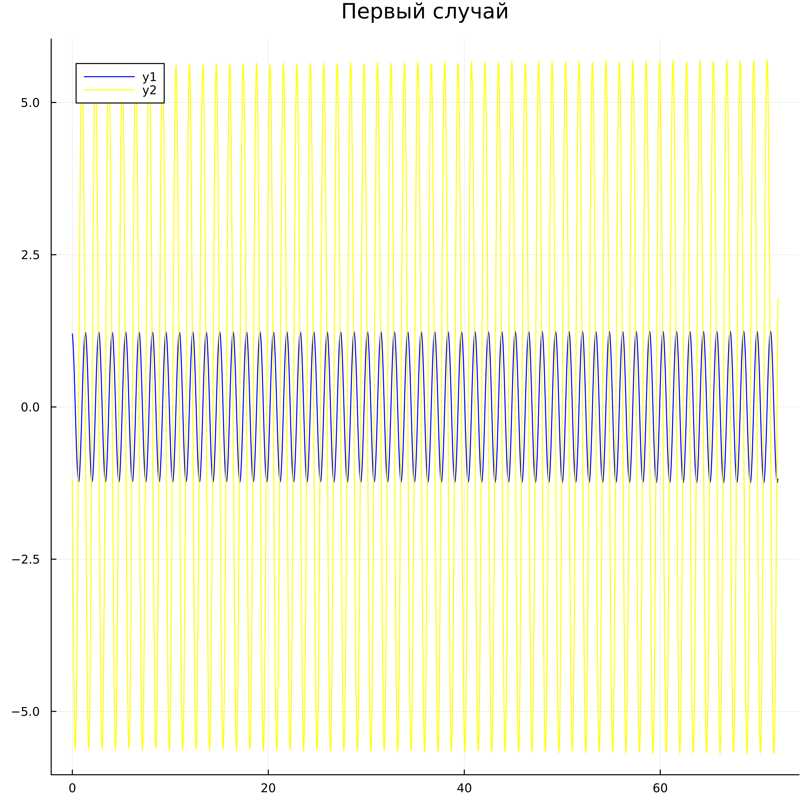
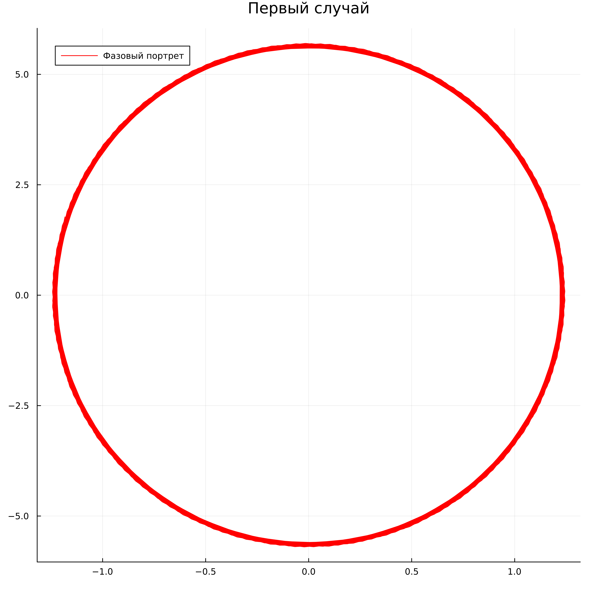
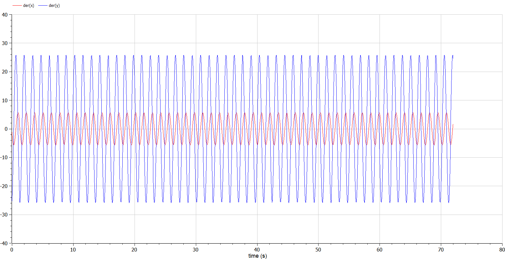
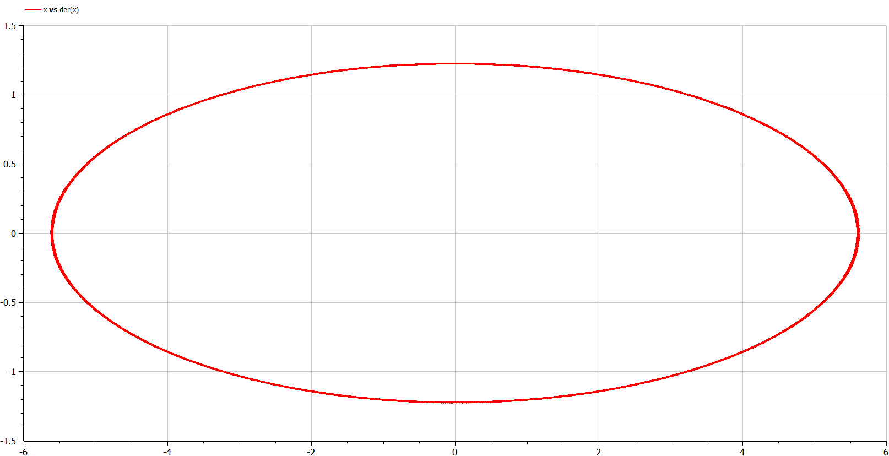
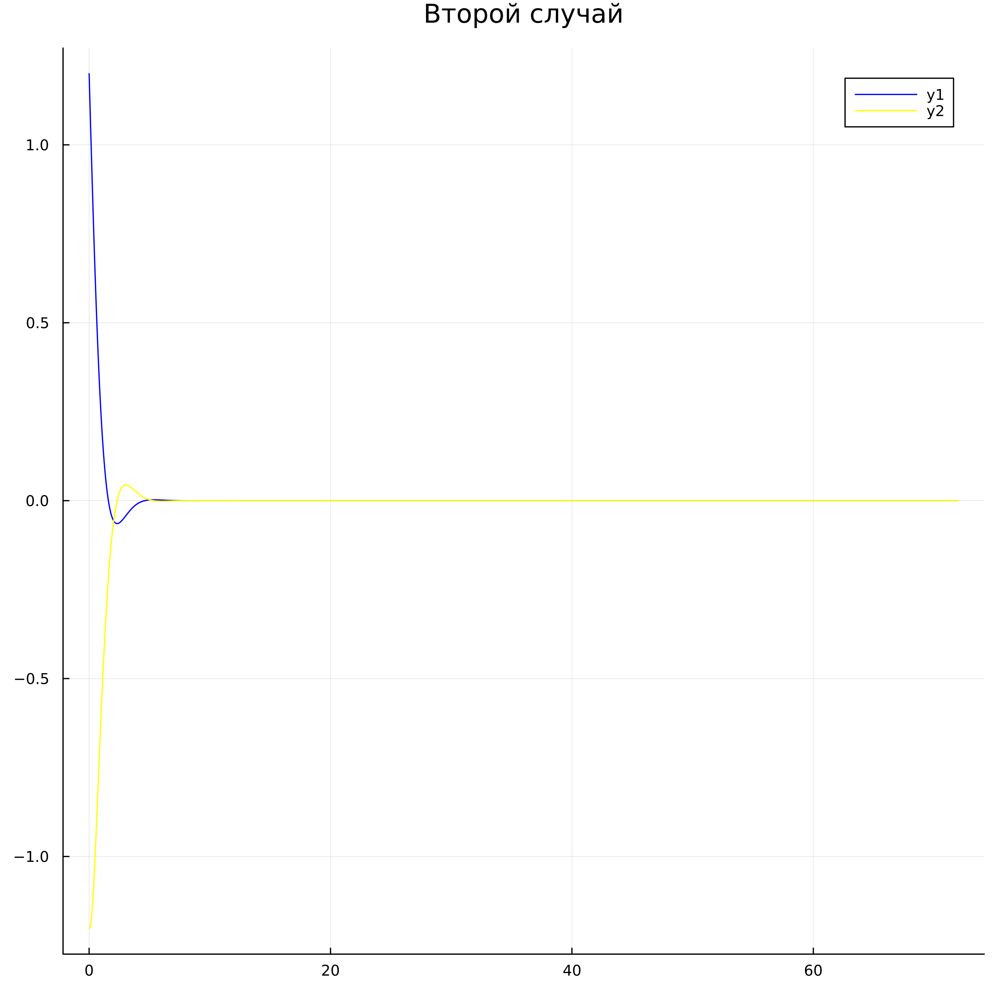
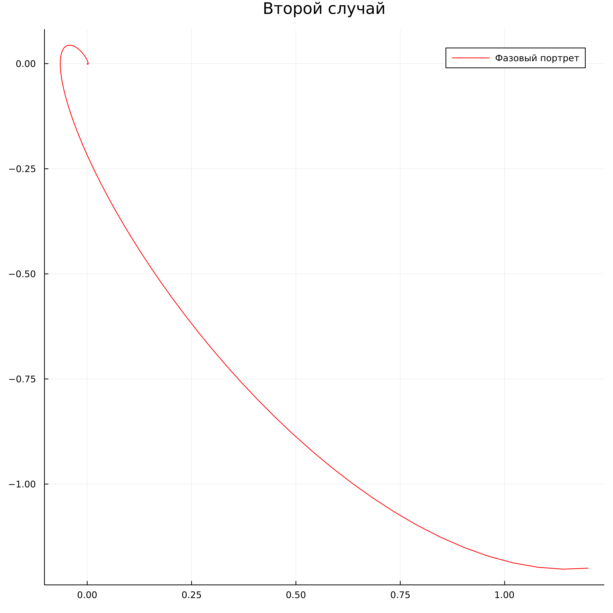
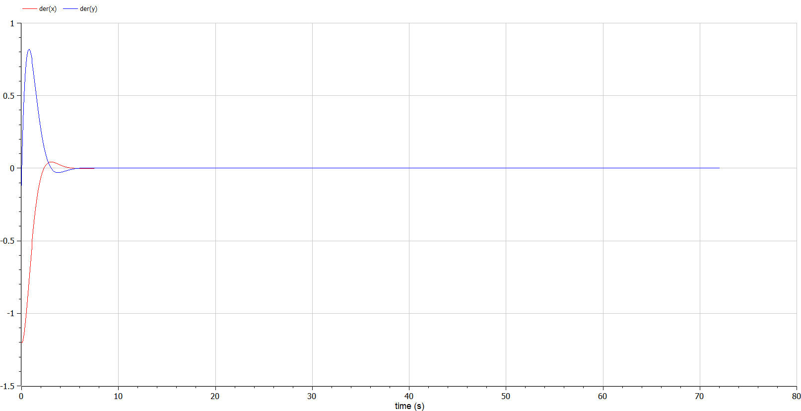
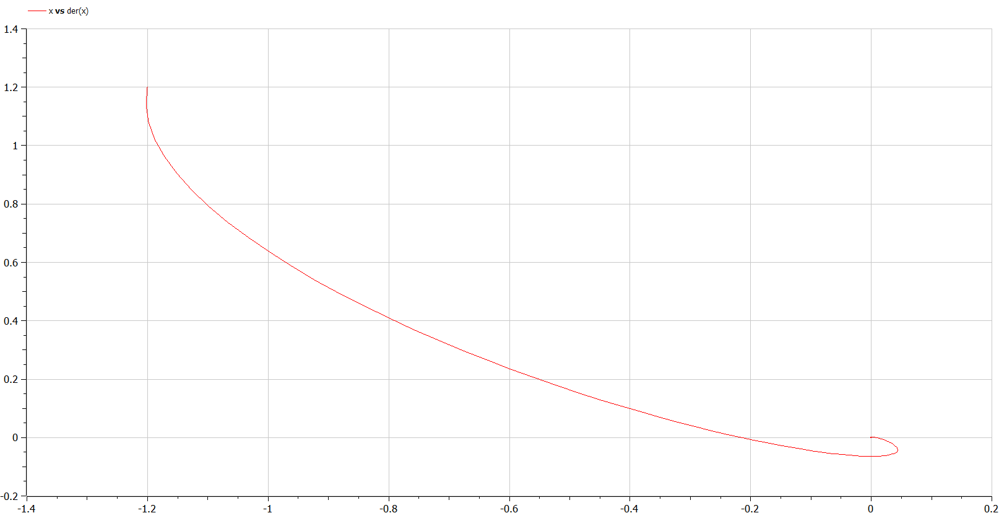
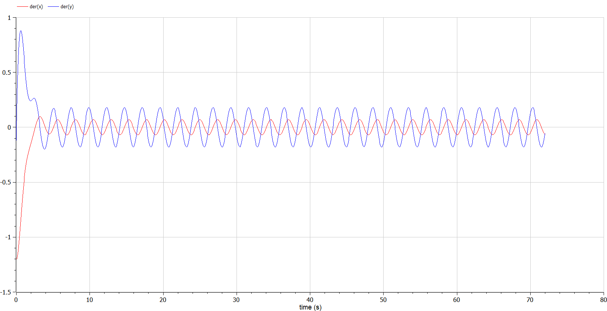
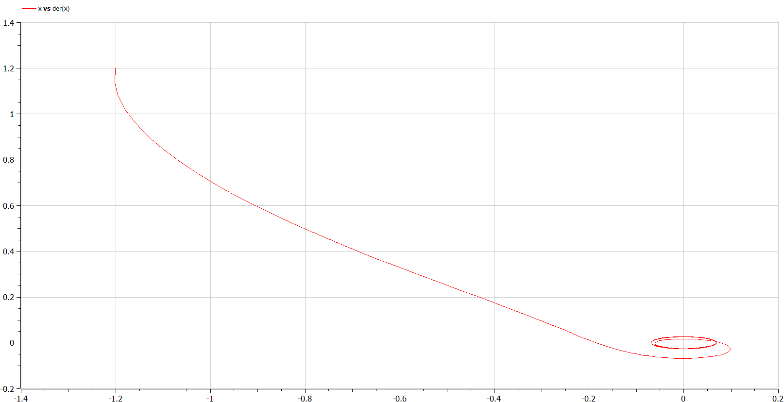

---
## Front matter                                 
title: Отчет по лабораторной работе №4 "Модель гармонических колебаний"
subtitle: "Дисциплина: Математическое моделирование"
author: "Выполнил: Гаглоев Олег Мелорович"

## Generic otions
lang: ru-RU
toc-title: "Содержание"

## Bibliography
bibliography: bib/cite.bib
csl: pandoc/csl/gost-r-7-0-5-2008-numeric.csl

## Pdf output format
toc: true # Table of contents
toc-depth: 2
lof: true # List of @figures
lot: true # List of tables
fontsize: 12pt
linestretch: 1.5
papersize: a4
documentclass: scrreprt
## I18n polyglossia
polyglossia-lang:
  name: russian
  options:
	- spelling=modern
	- babelshorthands=true
polyglossia-otherlangs:
  name: english
## I18n babel
babel-lang: russian
babel-otherlangs: english
## Fonts
mainfont: PT Serif
romanfont: PT Serif
sansfont: PT Sans
monofont: PT Mono
mainfontoptions: Ligatures=TeX
romanfontoptions: Ligatures=TeX
sansfontoptions: Ligatures=TeX,Scale=MatchLowercase
monofontoptions: Scale=MatchLowercase,Scale=0.9
## Biblatex
biblatex: true
biblio-style: "gost-numeric"
biblatexoptions:
  - parentracker=true
  - backend=biber
  - hyperref=auto
  - language=auto
  - autolang=other*
  - citestyle=gost-numeric
## Pandoc-crossref LaTeX customization
figureTitle: "Рис."
tableTitle: "Таблица"
listingTitle: "Листинг"
lofTitle: "Список иллюстраций"
lotTitle: "Список таблиц"
lolTitle: "Листинги"
## Misc options
indent: true
header-includes:
  - \usepackage{indentfirst}
  - \usepackage{float} # keep @figures where there are in the text
  - \floatplacement{@figure}{H} # keep @figures where there are in the text
---

# Цель работы

Создать модель гармонический колебаний по средствам языков Julia и OpenModelica.

# Задание
Постройте фазовый портрет гармонического осциллятора и решение уравнения
гармонического осциллятора для нескольких случаев на заданном интервале

# Теоретическое введение

Движение грузика на пружинке, маятника, заряда в электрическом контуре, а
также эволюция во времени многих систем в физике, химии, биологии и других
науках при определенных предположениях можно описать одним и тем же
дифференциальным уравнением, которое в теории колебаний выступает в качестве
основной модели. Эта модель называется линейным гармоническим осциллятором.

Уравнение свободных колебаний гармонического осциллятора имеет
следующий вид (формула [-@eq:01]):

$$
\ddot x+2\gamma\dot x+\omega^2_0x=0
$$ {#eq:01}

где x – переменная, описывающая состояние системы (смещение грузика, заряд
конденсатора и т.д.), $\gamma$ – параметр, характеризующий потери энергии (трение в
механической системе, сопротивление в контуре), $\omega_0$ – собственная частота
колебаний, $t$ – время. (Обозначения $\ddot x = \frac{d^2x}{dt^2}$, $\dot x = \frac{dx}{dt}$)

Уравнение [-@eq:01] есть линейное однородное дифференциальное уравнение
второго порядка и оно является примером линейной динамической системы.
При отсутствии потерь в системе ( $\gamma = 0$
) вместо уравнения [-@eq:01] получаем
уравнение консервативного осциллятора энергия колебания которого сохраняется
во времени (формула [-@eq:02]).

$$
\ddot x + \omega^2_0x = 0
$$ {#eq:02}

Для однозначной разрешимости уравнения второго порядка [-@eq:02] необходимо
задать два начальных условия вида:

$$
\begin{cases}
x(t_0) = x_0
\\
\dot x(t_0) = y_0
\end{cases}
$$ {#eq:03}

Уравнение второго порядка [-@eq:02] можно представить в виде системы двух
уравнений первого порядка:

$$
\begin{cases}
\dot x = y
\\
\dot y = -\omega^2_0x
\end{cases}
$$ {#eq:04}

Начальные условия [-@eq:03] для системы [-eq:04] примут вид:

$$
\begin{cases}
x(t_0) = x_0
\\
y(t_0) = y_0
\end{cases}
$$ {#eq:05}

Независимые переменные $x$, $y$ определяют пространство, в котором
«движется» решение. Это фазовое пространство системы, поскольку оно двумерно
будем называть его фазовой плоскостью.

Значение фазовых координат $x$, $y$ в любой момент времени полностью
определяет состояние системы. Решению уравнения движения как функции
времени отвечает гладкая кривая в фазовой плоскости. Она называется фазовой
траекторией. Если множество различных решений (соответствующих различным
начальным условиям) изобразить на одной фазовой плоскости, возникает общая
картина поведения системы. Такую картину, образованную набором фазовых
траекторий, называют фазовым портретом.

# Выполнение лабораторной работы

1. К выполнению нам предлагается выполнить соответстующий номеру студенчесткого билета вариант: 1032201347 % 70 + 1 = 38

2. Задача предложенного варианта состоит в следующем:

Постройте фазовый портрет гармонического осциллятора и решение уравнения гармонического осциллятора для следующих случаев

- Колебания гармонического осциллятора без затуханий и без действий внешней силы $\ddot x +21x=0$

- Колебания гармонического осциллятора c затуханием и без действий внешней силы $\ddot x + 2.2\dot x +2.3x = 0$

- Колебания гармонического осциллятора c затуханием и под действием внешней силы $\ddot x + 2.4\dot x +2.5x = 0.2\sin(2.6t)$

На интервале $t \in [0; 72]$ (шаг 0.05) с начальными условиями $x_0 = 1.2$, $y_0=-1.2$.

1. В общем виде можем записать наше однородное ОДУ второго порядка следующим образом:

$$
\frac{d^2x(t)}{dt^2} + a\frac{dx}{dt} + bx(t) = F(t)
$$ {#eq:06}

где $\frac{dx}{dt} = \dot x$ - производная по времени:

$$
\ddot x(t) + a\dot x(t) + bx = F(t)
$$ {#eq:07}

Можно сделать систему ОДУ:

$$
\begin{aligned}
y = \frac{dx}{dt} = \dot x(t)
\\
\frac{d^2x}{dt^2} = \frac{dy}{dt}
\\
\frac{dy}{dt} + ay(t) + bx(t) = 0
\end{aligned}
$$ {#eq:08}

Тогда система для решения:

$$
\begin{cases}
  \frac{dx}{dt} = y
  \\
  \frac{dy}{dt} = -gy - wx
\end{cases}
$$ {#eq:09}

4. **Первый случай** - колебания гармонического осциллятора без затуханий и без действий внешней силы $\ddot x +21x=0$ .

Отсюда видим, что $g = 0$ и $F(t) = 0$.

Если $F(t) = 0$ и $w \ne 0$, значит есть трение и система затухнет.

Если $F(t) = 0$ и $w = 0$, то трения нет.

Если $F(t) \ne 0$, то система никогда не затухнет, но энергия будет уходить на силу трения за счет внешней силы.

Общий вид первого случая: $\ddot x + wx = 0$, где $w = \omega^2_0 = 21$.

Тогда система ОДУ первого порядка для решения задачи:

$$
\begin{cases}
  \dot x = y
  \\
  \dot y = -21x
\end{cases}
$$ {#eq:10}

Код для первого случая на Julia (рис. @fig:001)

{#fig:001 width=40%}

График для первого случая - Julia (рис. @fig:002):

{#fig:002 width=40%}

Фазовый портрет Julia (рис. @fig:003):

{#fig:003 width=40%}

Код для первого случая на OpenModelica (рис. @fig:004):

{#fig:004 width=40%}

График для первого случая - OpenModelica (рис. @fig:005):

{#fig:005 width=40%}

Фазовый портрет OpenModelica (рис. @fig:006)

{#fig:006 width=40%}

5. **Второй случай** - колебания гармонического осциллятора c затуханием и без действий внешней силы $\ddot x + \dot 2.2x +2.3x = 0$

Отсюда видим, что $F(t) = 0$.

Общий вид второго случая: $\ddot x + gy + wx = 0$, где $g = 2\gamma = 1$ и $w = \omega^2_0 = 10$.

Тогда система ОДУ первого порядка для решения задачи:

$$
\begin{cases}
  \dot x = y
  \\
  \dot y = -2.2y -2.3x
\end{cases}
$$ {#eq:11}

Код для второго случая на Julia(рис. @fig:007) :

{#fig:007 width=40%}

График для второго случая Julia(рис. @fig:008) :

{#fig:008 width=40%}

Фазовый портрет второго случая Julia(рис. @fig:009):

{#fig:009 width=40%} 

Код для второго случая OpenModelica(рис. @fig:010):

{#fig:010 width=40%} 

График для второго случая OpenModelica(рис. @fig:011):

{#fig:011 width=40%} 

Фазовый портрет второго случая OpenModelica (рис. @fig:012):

{#fig:012 width=40%} 

1. **Третий случай** - колебания гармонического осциллятора c затуханием и под действием внешней силы $\ddot x + \dot x +11x = 2\cos(t)$

Отсюда видим, что $F(t) =0.2\sin(2.6t)$.

Общий вид третьего случая: $\ddot x + ay + bx = F(t)$, где $g = 2\gamma = 2.4$, $w = \omega^2_0 = 2.5$ и $F(t) =0.2\sin(2.6t)$..

Тогда система ОДУ первого порядка для решения задачи:

$$
\begin{cases}
  \dot x = y
  \\
  \dot y = 0.2\sin(2.6t) -2.4y -2.5x
\end{cases}
$$ {#eq:12}

Код для третьего случая Julia (рис. @fig:013):

{#fig:013 width=40%} 

График для третьего случая Julia (рис. @fig:014):

{#fig:014 width=40%} 

Фазовый портрет третьего случая Julia (рис. @fig:015):

{#fig:015 width=40%} 

Код для 3 случая OpenMOdelica (рис. @fig:016):

{#fig:016 width=40%} 

График для третьего случая OpenModelica (рис. @fig:017):

{#fig:017 width=40%}

Фазовый портрет третьего случая OpenModelica (рис. @fig:018):

{#fig:018 width=40%}

# Выводы

Я создал модель гармоническиx колебаний по средствам языков Julia и OpenModelica.

# Список литературы{.unnumbered}

::: {#refs}
:::
