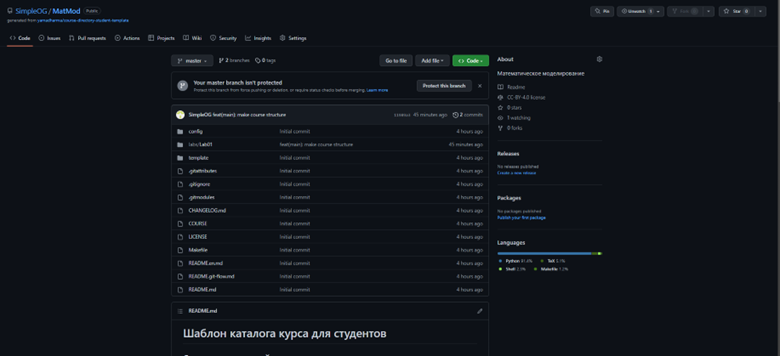
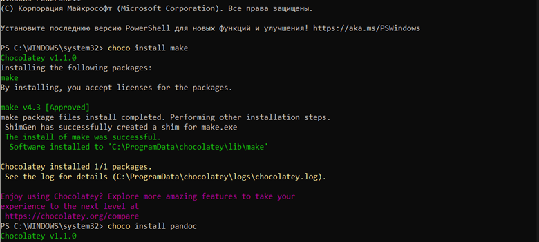
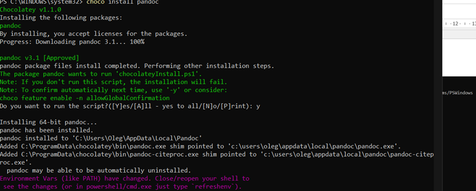
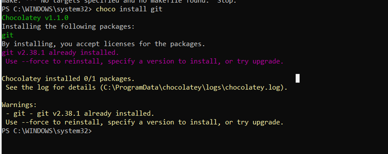
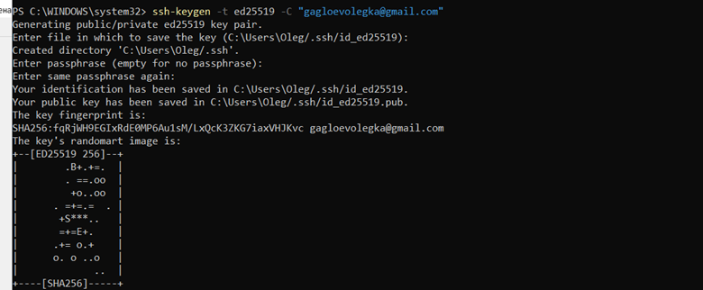
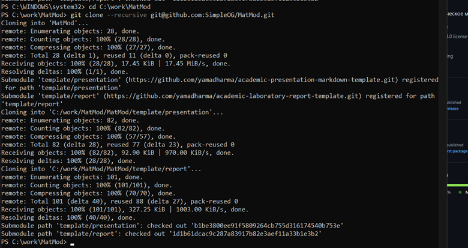
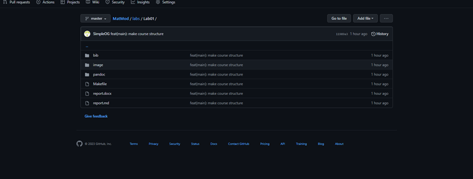

---
## Front matter
lang: ru-RU
title: Структура научной презентации
subtitle: Простейший шаблон
author:
  - Гаглоев Олег Мелорович
institute:
  - Российский университет дружбы народов, Москва, Россия
  
date: 11 02 2023

## i18n babel
babel-lang: russian
babel-otherlangs: english

## Formatting pdf
toc: false
toc-title: Содержание
slide_level: 2
aspectratio: 169
section-titles: true
theme: metropolis
header-includes:
 - \metroset{progressbar=frametitle,sectionpage=progressbar,numbering=fraction}
 - '\makeatletter'
 - '\beamer@ignorenonframefalse'
 - '\makeatother'
---

# Информация

## Докладчик

  * Гаглоев Олег Мелорович
  * студент
 
  * Российский университет дружбы народов
  * 1032201347@pfur.ru
  * https://github.com/SimpleOG/MatMod

# Вводная часть

## Актуальность

- Получение навыков работы с репозиторием
- Развитие стрессоустойчивости во время выполнения 

## Объект и предмет исследования

- GitHub для хранения и использования проектов

## Цели и задачи

- Создать и настроить репозиторий по шаблону

## Материалы и методы

- GitHub
- Результирующие форматы
	- `pdf`
	- `html`
- Автоматизация процесса создания: `Makefile`

# Выполнение работы
- Копируем репозиторий с GitHub
  

- Устанавливаем необходимые компоненты
  

- Получаем ssh ключ
  

- Применяем ssh ключ
  
 

- Копируем репозиторий в локальную папку
  
  

- Загружаем репозиторий на GitHub
  
- 
## Результаты

- Репозиторий создан
- Выполнение makefile почти идеальное

## Вывод
- Я создал и настроил репозиторий на ГитХабе, освоил навыки создания и управления своим аккаунт.

