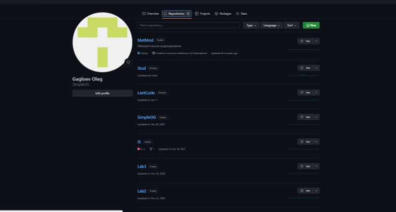
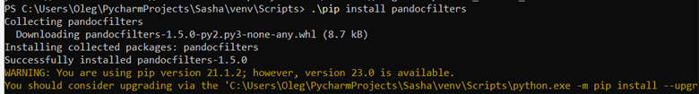

---
## Front matter
title: "Отчет по лабораторной работе 1"
author: "Гаглоев Олег Мелорович"

## Generic otions
lang: ru-RU
toc-title: "Содержание"

## Bibliography
bibliography: bib/cite.bib
csl: pandoc/csl/gost-r-7-0-5-2008-numeric.csl

## Pdf output format
toc: true # Table of contents
toc-depth: 2
lof: true # List of figures
lot: true # List of tables
fontsize: 12pt
linestretch: 1.5
papersize: a4
documentclass: scrreprt
## I18n polyglossia
polyglossia-lang:
  name: russian
  options:
	- spelling=modern
	- babelshorthands=true
polyglossia-otherlangs:
  name: english
## I18n babel
babel-lang: russian
babel-otherlangs: english
## Fonts
mainfont: PT Serif
romanfont: PT Serif
sansfont: PT Sans
monofont: PT Mono
mainfontoptions: Ligatures=TeX
romanfontoptions: Ligatures=TeX
sansfontoptions: Ligatures=TeX,Scale=MatchLowercase
monofontoptions: Scale=MatchLowercase,Scale=0.9
## Biblatex
biblatex: true
biblio-style: "gost-numeric"
biblatexoptions:
  - parentracker=true
  - backend=biber
  - hyperref=auto
  - language=auto
  - autolang=other*
  - citestyle=gost-numeric
## Pandoc-crossref LaTeX customization
figureTitle: "Рис."
tableTitle: "Таблица"
listingTitle: "Листинг"
lofTitle: "Список иллюстраций"
lotTitle: "Список таблиц"
lolTitle: "Листинги"
## Misc options
indent: true
header-includes:
  - \usepackage{indentfirst}
  - \usepackage{float} # keep figures where there are in the text
  - \floatplacement{figure}{H} # keep figures where there are in the text
---

# **Цель работы**

Создание репозитория курса на основе шаблона.Управление GitHub с помощью консоли

# **Задание**
1. Скопировать Репозиторий с GitHub 
2. Настроить управление репозиторием
3. Провести установку необходимых для работы репозитория программ

# **Теоретическое введение**
Мы будем использовать репозиторий с GitHub. Для выполнения отчета мы будем использовать markdown

# **Выполнение лабораторной работы**

1. Открываем профиль в GitHub
  

{#fig:001 width=40%}

2. Теперь перехожу по ссылке в нужный профиль и создаю репозиторий на основе данного

{#fig:001 width=40%}

3. Скачаю необходимые компоненты

4. Создадим ключ ssh для удаленного контроля репозитория

5. Запустим сервис ssh agent

6. Применим ssh ключ

7. Скачаем репозиторий с ГитХаба в созданную папку

8. Запустим make , чтобы выполнить содержимое файла makefile

9. Скачаем дополнительные файлы, чтобы все заработало

Во время установки texlive произошла куча ошибок,поэтому установить не получилось

10. Загрузим изменения обратно на ГитХаб

# **Выводы**

Я смог создать и настроить репозиторий на основе шаблона.

# **Список литературы**
