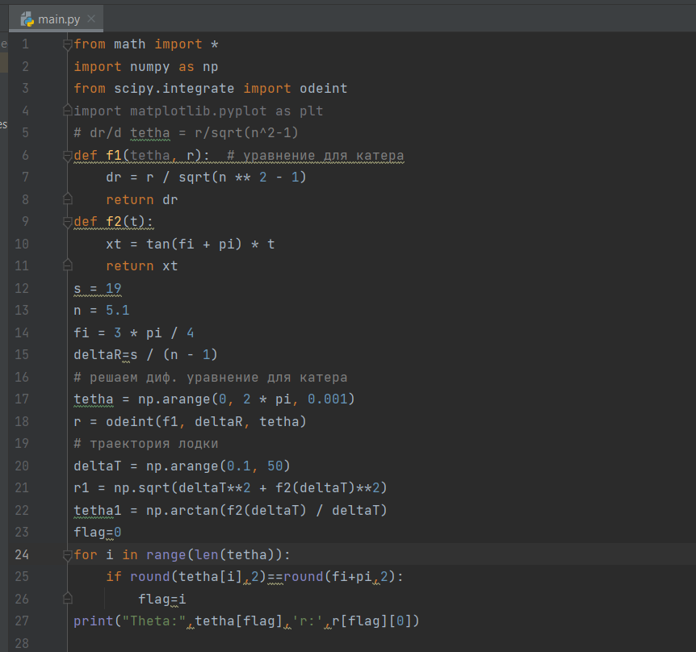
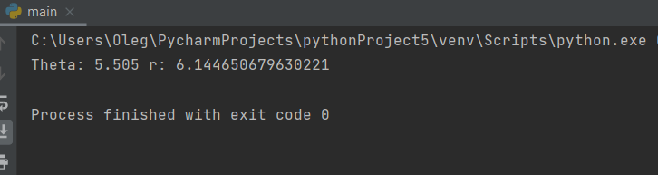
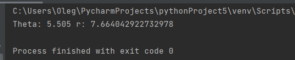

---
## Front matter
lang: ru-RU
title: Презентация к лабораторной работе 2
author:
  - Гаглоев Олег Мелорович
institute:
  - Российский университет дружбы народов, Москва, Россия
 
date: 18 февраля 2023

## i18n babel
babel-lang: russian
babel-otherlangs: english

## Formatting pdf
toc: false
toc-title: Содержание
slide_level: 2
aspectratio: 169
section-titles: true
theme: metropolis
header-includes:
 - \metroset{progressbar=frametitle,sectionpage=progressbar,numbering=fraction}
 - '\makeatletter'
 - '\beamer@ignorenonframefalse'
 - '\makeatother'
---

# Информация

## Докладчик

:::::::::::::: {.columns align=center}
::: {.column width="70%"}

  * Гаглоев Олег Мелорович
  * студент
  * Российский университет дружбы народов
  * https://github.com/SimpleOG?tab=repositories)

:::
::: {.column width="30%"}

:::
::::::::::::::

# Вводная часть

## Актуальность

-Математика всегда полезна для развития интеллекта

## Объект и предмет исследования

-Julia и моделирование ситуаций

## Цели и задачи

На море в тумане катер береговой охраны преследует лодку
браконьеров. Через определенный промежуток времени
туман рассеивается, и лодка обнаруживается на расстоянии
k км от катера. Затем лодка снова скрывается в тумане и
уходит прямолинейно в неизвестном направлении.
Известно, что скорость катера в n раза больше скорости
браконьерской лодки. Необходимо определить по какой
траектории необходимо двигаться катеру, чтоб нагнать
лодку.

## Материалы и методы

- Python
- Математические библиотеки для python

## Цели и задачи

- Провести необходимые рассуждения и вывод
дифференциальных уравнений, если скорость катера
больше скорости лодки в n раз.
- Построить траекторию движения катера и лодки для
двух случаев.
- Определить по графику точку пересечения катера и
лодки.

## Содержание исследования

Смоделировать ситуацию и найти точки пересечения

## Пишем код на питоне, основываясь на математических вычислениях, приведённых в отчете

## Результаты

## Вывод

Я попробовал смоделировать ситуацию и решить задачу. Математически вышло, а вот графически нет

