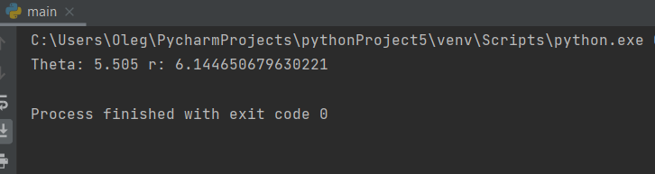
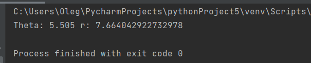

---
## Front matter
title: "Лабораторная работа №2"
subtitle: "Задача о погоне"
author: "Гаглоев Олег"

## Pdf output format
toc: true # Table of contents
toc-depth: 2
lof: true # List of figures
lot: true # List of tables
fontsize: 12pt
linestretch: 1.5
papersize: a4
documentclass: scrreprt
## I18n polyglossia
polyglossia-lang:
  name: russian
  options:
	- spelling=modern
	- babelshorthands=true
polyglossia-otherlangs:
  name: english
## I18n babel
babel-lang: russian
babel-otherlangs: english
## Fonts
mainfont: PT Serif
romanfont: PT Serif
sansfont: PT Sans
monofont: PT Mono
mainfontoptions: Ligatures=TeX
romanfontoptions: Ligatures=TeX
sansfontoptions: Ligatures=TeX,Scale=MatchLowercase
monofontoptions: Scale=MatchLowercase,Scale=0.9
## Biblatex
biblatex: true
biblio-style: "gost-numeric"
biblatexoptions:
  - parentracker=true
  - backend=biber
  - hyperref=auto
  - language=auto
  - autolang=other*
  - citestyle=gost-numeric
## Pandoc-crossref LaTeX customization
figureTitle: "Рис."
tableTitle: "Таблица"
listingTitle: "Листинг"
lofTitle: "Список иллюстраций"
lotTitle: "Список таблиц"
lolTitle: "Листинги"
## Misc options
indent: true
header-includes:
  - \usepackage{indentfirst}
  - \usepackage{float} # keep figures where there are in the text
  - \floatplacement{figure}{H} # keep figures where there are in the text
---

# Цель работы
Вариант 38
Приведем один из примеров построения математических моделей для
выбора правильной стратегии при решении задач поиска.
Например, рассмотрим задачу преследования браконьеров береговой
охраной. 
На море в тумане катер береговой охраны преследует лодку браконьеров.
Через определенный промежуток времени туман рассеивается, и лодка
обнаруживается на расстоянии 19 км от катера. Затем лодка снова скрывается в
тумане и уходит прямолинейно в неизвестном направлении. Известно, что скорость
катера в 5,1 раза больше скорости браконьерской лодки.
Необходимо определить по какой траектории необходимо двигаться катеру,
чтоб нагнать лодку.

# Задание

1. Запишите уравнение, описывающее движение катера, с начальными
условиями для двух случаев (в зависимости от расположения катера
относительно лодки в начальный момент времени).
2. Постройте траекторию движения катера и лодки для двух случаев.
3. Найдите точку пересечения траектории катера и лодки 

# Теоретическое введение

Файл в приложении к Лабораторной работе №2

# Выполнение лабораторной работы
Я не разобрался в julia, а так как баллы терять не хочется, попробовал написать на питоне, поэтому скорее всего баллов не получу
Принимаем за t_0=0 , X_0=0 - место нахождения лодки браконьеров в момент
обнаружения, X_0=k - место нахождения катера береговой охраны
относительно лодки браконьеров в момент обнаружения лодки.
Введем полярные координаты. Считаем, что полюс - это точка
обнаружения лодки браконьеров x_0=0(θ=x_0=0), а полярная ось r проходит
через точку нахождения катера береговой охраны.

Чтобы найти расстояние x после которого катер начнет
двигаться вокруг полюса , необходимо составить простое уравнение.
Пусть через время t катер и лодка окажутся на одном расстоянии x от полюса. За
это время лодка пройдет x , а катер k-x (или k+x , в зависимости от начального
положения катера относительно полюса). Время, за которое они пройдут это расстояние,
вычисляется как x/v или (x+k/)v ( или (x-k)/v во втором случае).
Так как время одно и то же, то эти величины одинаковы.
Тогда неизвестное расстояние x можно найти из следующего уравнения:
x/v=(x+k)/v или (x-k)/v во втором случае
Отсюда мы найдем два значения x1 и x2, задачу будем решать для двух
случаев:
x_1=k/n+1, при tetha=0
x_2=k/n-1, при tetha = -pi
После того, как катер береговой охраны окажется на одном расстоянии от полюса,
что и лодка, он должен сменить прямолинейную траекторию и начать двигаться вокруг
полюса удаляясь от него со скоростью лодки v.
Для этого скорость катера раскладываем на две составляющие: vr - радиальная скорость
и vt- тангенциальная скорость.
Радиальная скорость - это скорость, с которой катер удаляется от полюса V_r=dr/dt.Нам нужно,
чтобы эта скорость была равна скорости лодки, поэтому полагаем v=dr/dt.
Тангенциальная скорость – это линейная скорость вращения катера относительно полюса. 
Она равна произведению угловой скорости d tetha/ dt на радиус r. vr=r*d tetha/dt

Используя теорему Пифагора получаем :v_t =sqrt (n^2 * v^2 - v^2)=v * sqrt(n^2-1). 
Теперь приравняем значения v_t и получаем:  r * d tetha/dt=v * sqrt(n^2-1)
Решение исходной задачи сводится к решению системы из двух
дифференциальных уравнений:
v=dr/dt и
r * d tetha/dt=v * sqrt(n^2-1)
Исключим из системы переменную t и получим следующее уравнение:
dr/d tetha = r/sqrt(n^2-1)
Теперь имея два разных начальных условия , посмотрим на результаты выполнения программы
Сами начальные условия:

{ tetha=0

{r_0= s/(n+1)

и

{ tetha=−π

{r_0= s/ (n−1)

Графики построить не удалось из за какой то ошибки. В итоге ни на джулии не написал полностью, ни на питоне
Получившиеся решения:
Для первого случая

Для второго случая:

# Выводы

Я смоделировал ситуацию, описанную в задаче и нашел необходимые значения

# Список литературы{.unnumbered}
Текст к лабораторной работе №2 в ТУИС https://esystem.rudn.ru/pluginfile.php/1971721/mod_resource/content/2/Лабораторная%20работа%20№%201.pdf
