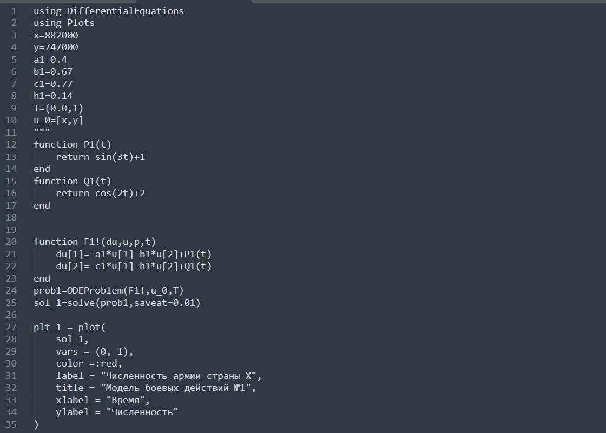
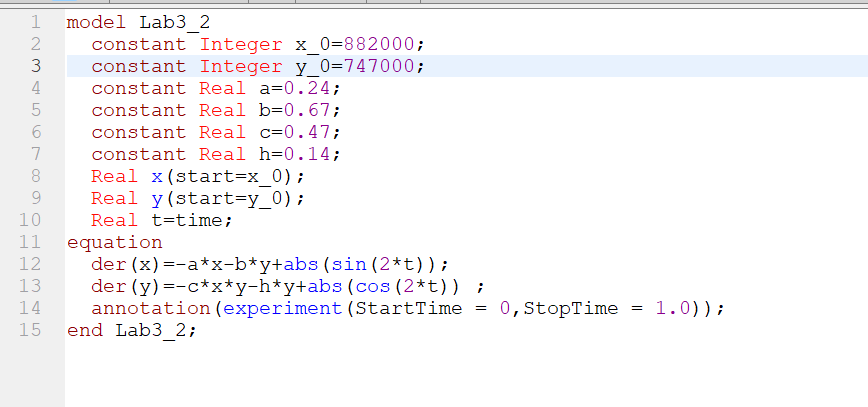
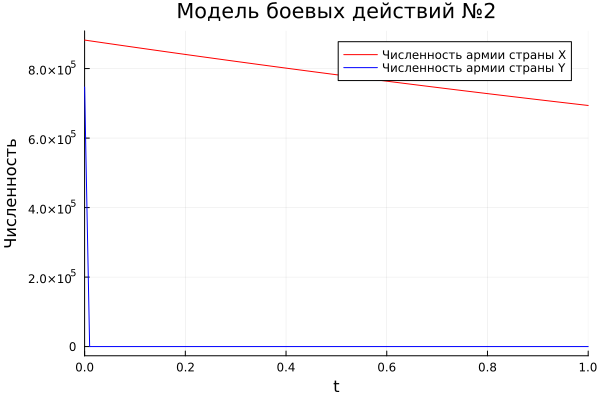
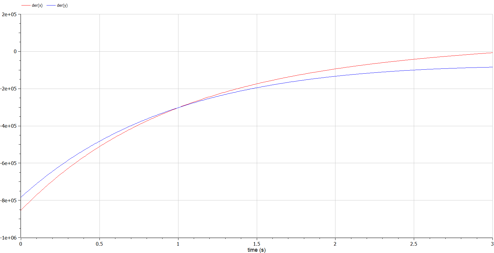
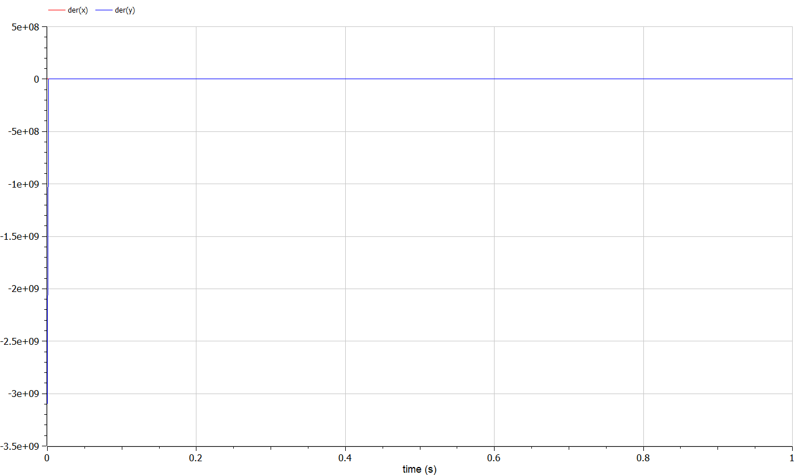

---
## Front matter
lang: ru-RU
title: Лабораторная работа №3
subtitle: Модель военных действий
author:
  - Гаглоев Олег Мелорович
institute:
  - Российский университет дружбы народов, Москва, Россия
date: 25 февраля 2023

## i18n babel
babel-lang: russian
babel-otherlangs: english

## Formatting pdf
toc: false
toc-title: Содержание
slide_level: 2
aspectratio: 169
section-titles: true
theme: metropolis
header-includes:
 - \metroset{progressbar=frametitle,sectionpage=progressbar,numbering=fraction}
 - '\makeatletter'
 - '\beamer@ignorenonframefalse'
 - '\makeatother'
---

# Информация

## Докладчик

  * Гаглоев Олег Мелорович
  * студент уч. группы НПИбд-01-20
  * Российский университет дружбы народов
  * [1032201347@pfur.ru](mailto:1032201347@rudn.ru)
  * <https://github.com/SimpleOG>

# Вводная часть

## Актуальность

- Математика всегда полезна для ума

## Объект и предмет исследования

- Задача о ведении боевых действий
- Языки для моделирования:
  - Julia
  - OpenModelica

## Цели и задачи

- Рассмотреть два случая ведения боевых действий:
  1. Модель боевых действий между регулярными войсками;
  2. Модель ведение боевых действий с участием регулярных войск и партизанских отрядов;
- Построить графики изменения численности войск армии Х и армии У для соответствующих случаев.

## Материалы и методы

- Языки для моделирования:
  - Julia
  - OpenModelica

# Процесс выполнения работы

## Условие модели №1

- Модель боевых действий между регулярными войсками:

    $$
    \begin{cases}
      \frac{dx}{dt}=-0.4x(t)-0.67y(t)+\sin(3t)+1
      \\
      \frac{dy}{dt}=-0.77x(t)-0.14y(t)+\cos(2t)+2
    \end{cases}
    $$

## Теория модели №1

$$
  \begin{cases}
    \frac{dx}{dt}=-a(t)x(t)-b(t)y(t)+R(t)
    \\
    \frac{dy}{dt}=-c(t)x(t)-h(t)y(t)+Q(t)
  \end{cases}
$$
$$
\begin{cases}
    \dot{x}=-by
    \\
    \dot{y}=-cx
  \end{cases}
$$
$$
\begin{aligned}
  \frac{dx}{dy}=\frac{by}{cx}\\ 
  cxdx=bydy\\ 
  cx^2-by^2=C
\end{aligned}
$$

## Условие модели №2

$$
  \begin{cases}
    \frac{dx}{dt}=-0.24x(t)-0.67y(t)+|\sin(2t)|
    \\
    \frac{dy}{dt}=-0.47x(t)y(t)-0.14y(t)+|\cos(2t)|
  \end{cases}
$$

## Теория модели №2

$$
  \begin{cases}
    \frac{dx}{dt}=-a(t)x(t)-b(t)y(t)+R(t)
    \\
    \frac{dy}{dt}=-c(t)x(t)y(t)-h(t)y(t)+Q(t)
  \end{cases}
$$
$$
  \begin{cases}
    \frac{dx}{dt}=-by(t)
    \\
    \frac{dy}{dt}=-cx(t)y(t)
  \end{cases}
$$
$$
\frac{d}{dt}\left(\frac{b}{2}x^{2}(t)-cy(t)\right)=0
$$
$$
\frac{b}{2}x^{2}(t)-cy(t)=\frac{b}{2}x^{2}(0)-cy(0)=C_{1}
$$

## Код на Julia

:::::::::::::: {.columns align=center}
::: {.column width="50%"}

:::
::: {.column width="50%"}

:::
::::::::::::::

## Код на OpenModelica

:::::::::::::: {.columns align=center}
::: {.column width="50%"}

:::
::: {.column width="50%"}

:::
::::::::::::::

## Графики Julia

:::::::::::::: {.columns align=center}
::: {.column width="50%"}

:::
::: {.column width="50%"}

:::
::::::::::::::

## Графики Modelica

:::::::::::::: {.columns align=center}
::: {.column width="50%"}

:::
::: {.column width="50%"}

:::
::::::::::::::

# Результаты работы

- Рассмотрено два случая ведения боевых действий:
  1. Модель боевых действий между регулярными войсками;
  2. Модель ведение боевых действий с участием регулярных войск и партизанских отрядов;
- Построены графики изменения численности войск армии Х и армии У для соответствующих случаев.

# Вывод

Я создал модель боевых действий по средствам языков Julia и OpenModelica. Построил соответствующие графики двух случаев ведения боевых действий.

