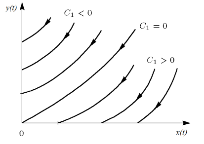
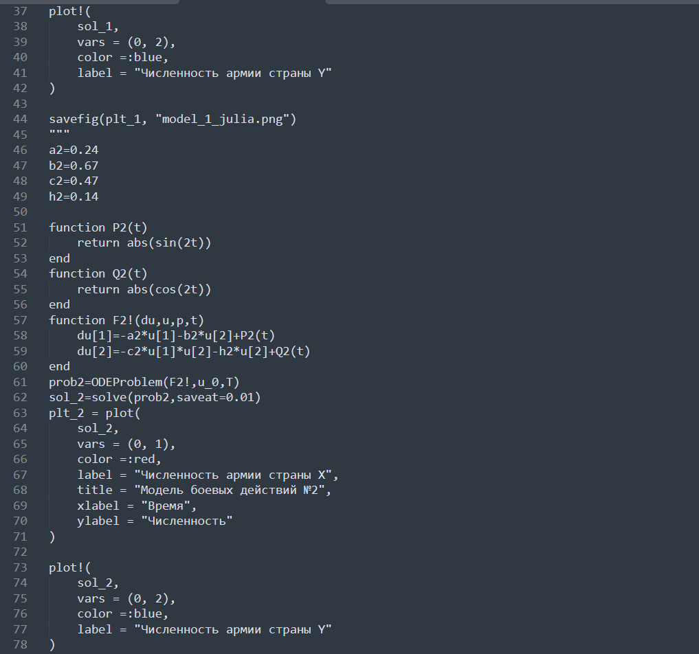
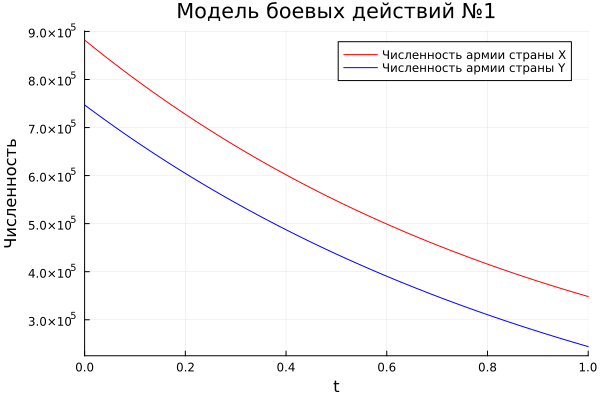
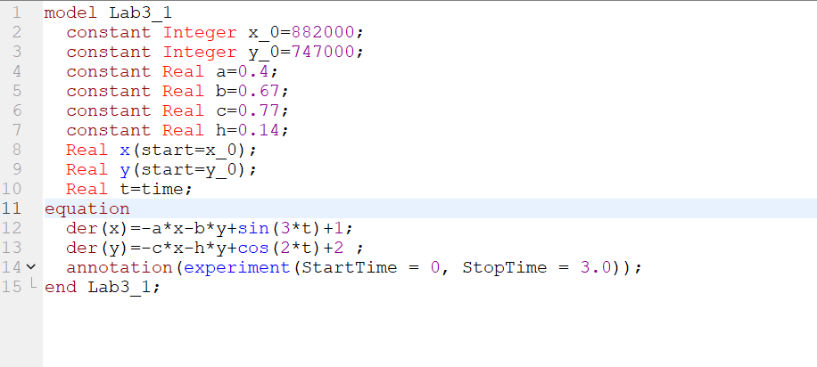

---
## Front matter
title: "Отчет по лабораторной работе №3"
subtitle: "Дисциплина: Математическое моделирование"
author: "Выполнил: Гаглоев Олег Мелорович"

## Generic otions
lang: ru-RU
toc-title: "Содержание"

## Bibliography
bibliography: bib/cite.bib
csl: pandoc/csl/gost-r-7-0-5-2008-numeric.csl

## Pdf output format
toc: true # Table of contents
toc-depth: 2
lof: true # List of figures
lot: true # List of tables
fontsize: 12pt
linestretch: 1.5
papersize: a4
documentclass: scrreprt
## I18n polyglossia
polyglossia-lang:
  name: russian
  options:
	- spelling=modern
	- babelshorthands=true
polyglossia-otherlangs:
  name: english
## I18n babel
babel-lang: russian
babel-otherlangs: english
## Fonts
mainfont: PT Serif
romanfont: PT Serif
sansfont: PT Sans
monofont: PT Mono
mainfontoptions: Ligatures=TeX
romanfontoptions: Ligatures=TeX
sansfontoptions: Ligatures=TeX,Scale=MatchLowercase
monofontoptions: Scale=MatchLowercase,Scale=0.9
## Biblatex
biblatex: true
biblio-style: "gost-numeric"
biblatexoptions:
  - parentracker=true
  - backend=biber
  - hyperref=auto
  - language=auto
  - autolang=other*
  - citestyle=gost-numeric
## Pandoc-crossref LaTeX customization
figureTitle: "Рис."
tableTitle: "Таблица"
listingTitle: "Листинг"
lofTitle: "Список иллюстраций"
lotTitle: "Список таблиц"
lolTitle: "Листинги"
## Misc options
indent: true
header-includes:
  - \usepackage{indentfirst}
  - \usepackage{float} # keep figures where there are in the text
  - \floatplacement{figure}{H} # keep figures where there are in the text
---

# Цель работы

Создать модель боевых действий по средствам языков Julia и OpenModelica. Построить соответствующие графики двух случаев.

# Задание

- Смоделировать два случая ведения боевых действий:
  1. Модель боевых действий между регулярными войсками;
  2. Модель ведение боевых действий с участием регулярных войск и партизанских отрядов;
- Построить графики изменения численности войск армии Х и армии У для соответствующий случаев.

# Теоретическое введение

К нашему вниманию представлены некоторые простейшие модели боевых действий – модели
Ланчестера. В противоборстве могут принимать участие как регулярные войска,
так и партизанские отряды. В общем случае главной характеристикой соперников
являются численности сторон. Если в какой-то момент времени одна из
численностей обращается в нуль, то данная сторона считается проигравшей (при
условии, что численность другой стороны в данный момент положительна).

Рассмотрим два случая ведения боевых действий:

1. Боевые действия между регулярными войсками;

2. Боевые действия с участием регулярных войск и партизанских отрядов. 

**Первый случай:** численность регулярных войск определяется тремя
факторами:

- скорость уменьшения численности войск из-за причин, не связанных с
боевыми действиями (болезни, травмы, дезертирство);

- скорость потерь, обусловленных боевыми действиями
противоборствующих сторон (что связанно с качеством стратегии,
уровнем вооружения, профессионализмом солдат и т.п.);

- скорость поступления подкрепления (задаётся некоторой функцией от
времени).

**Второй случай :** в борьбу добавляются партизанские отряды. Нерегулярные
войска в отличии от постоянной армии менее уязвимы, так как действуют скрытно,
в этом случае сопернику приходится действовать неизбирательно, по площадям,
занимаемым партизанами. Поэтому считается, что тем потерь партизан,
проводящих свои операции в разных местах на некоторой известной территории,
пропорционален не только численности армейских соединений, но и численности
самих партизан.

# Выполнение лабораторной работы

Вариант 38

Условие задачи является следующим:

  Между страной $Х$ и страной $У$ идет война. Численность состава войск исчисляется от начала войны, и являются временными функциями $x(t)$ и $y(t)$. В
начальный момент времени страна Х имеет армию численностью 882 000 человек, а в распоряжении страны $У$ армия численностью в 747 000 человек. Для упрощения
модели считаем, что коэффициенты $a, b, c, h$ постоянны. Также считаем, что $P(t)$ и $Q(t)$ - непрерывные функции.

  Постройте графики изменения численности войск врмии $X$ и армии $Y$ для следующих случаев:

  - Модель боевых действий между регулярными войсками (формула [-@eq:01]):

    $$
    \begin{cases}
      \frac{dx}{dt}=-0.4x(t)-0.67y(t)+\sin(3t)+1
      \\
      \frac{dy}{dt}=-0.77x(t)-0.14y(t)+\cos(2t)+2
    \end{cases}
    $$ {#eq:01}

  - Модель ведение боевых действий с участием регулярных войск и партизанских отрядов (формула [-@eq:02]):

  $$
  \begin{cases}
    \frac{dx}{dt}=-0.24x(t)-0.67y(t)+|\sin(2t)|
    \\
    \frac{dy}{dt}=-0.47x(t)y(t)-0.14y(t)+|\cos(2t)|
  \end{cases}
  $$ {#eq:02}

1. Первый случай.

  Нам известно, что модель боевых дейтсвий между регулярными войсками описывается следующим образом (формула [-@eq:03]):

$$
  \begin{cases}
    \frac{dx}{dt}=-a(t)x(t)-b(t)y(t)+R(t)
    \\
    \frac{dy}{dt}=-c(t)x(t)-h(t)y(t)+Q(t)
  \end{cases}
  $$ {#eq:03}

  Здесь Потери, не связанные с боевыми действиями, описывают члены $-a(t)x(t)$ и $-h(t)y(t)$, члены $-b(t)y(t)$ и $-c(t)x(t)$ отражают потери на поле боя. Коэффициенты $b(t)$ и $c(t)$ указывают на эффективность боевых действий со
стороны $у$ и $х$ соответственно, $a(t), h(t)$ - величины, характеризующие степень влияния различных факторов на потери. Функции $P(t), Q(t)$ учитывают
возможность подхода подкрепления к войскам $Х$ и $У$ в течение одного дня.

  В простейшей модели борьбы двух противников коэффициенты
$b(t)$ и $c(t)$ являются постоянными. Попросту говоря, предполагается, что каждый солдат
армии $x$ убивает за единицу времени $c$ солдат армии $y$ (и, соответственно, каждый
солдат армии $y$ убивает $b$ солдат армии $x$). Также не учитываются потери, не
связанные с боевыми действиями, и возможность подхода подкрепления.
Состояние системы описывается точкой $(x,y)$ положительного квадранта плоскости.
Координаты этой точки, $x$ и $y$ - это численности противостоящих армий. Тогда
модель принимает вид (формула [-@eq:04]):

$$
\begin{cases}
    \dot{x}=-by
    \\
    \dot{y}=-cx
  \end{cases}
$$ {#eq:04}

  Это - жесткая модель, которая допускает точное решение ([-@eq:05]):

$$
\begin{aligned}
  \frac{dx}{dy}=\frac{by}{cx}\\ 
  cxdx=bydy\\ 
  cx^2-by^2=C
\end{aligned}
$$ {#eq:05}

  Эволюция численностей армий $x$ и $y$ происходит вдоль гиперболы, заданной
этим уравнением (рис. [@fig:01]). По какой именно гиперболе пойдет война, зависит от начальной точки. 

{#fig:01 width=70%}

  Эти гиперболы разделены прямой $\sqrt{c}x=\sqrt{b}y$. Если начальная точка лежит
выше этой прямой, то гипербола выходит на ось $y$. Это значит, что в ходе войны
численность армии $x$ уменьшается до нуля (за конечное время). Армия $y$
выигрывает, противник уничтожен.
Если начальная точка лежит ниже, то выигрывает армия $x$. В разделяющем
эти случаи состоянии (на прямой) война заканчивается истреблением обеих армий.
Но на это требуется бесконечно большое время: конфликт продолжает тлеть, когда
оба противника уже обессилены.

4. По условию задачи  в первом случае мы имеем следующие начальные значения:
Подставим значения из варианта

5. Во втором случае в борьбу добавляются партизанские отряды. Нерегулярные
войска в отличии от постоянной армии менее уязвимы, так как действуют скрытно,
в этом случае сопернику приходится действовать неизбирательно, по площадям,
занимаемым партизанами. Поэтому считается, что тем потерь партизан,
проводящих свои операции в разных местах на некоторой известной территории,
пропорционален не только численности армейских соединений, но и численности
самих партизан. В результате модель принимает вид (формула [-@eq:06]):

$$
  \begin{cases}
    \frac{dx}{dt}=-a(t)x(t)-b(t)y(t)+R(t)
    \\
    \frac{dy}{dt}=-c(t)x(t)y(t)-h(t)y(t)+Q(t)
  \end{cases}
$$ {#eq:06}

  В этой системе все величины имею тот же смысл, что и в системе [-@eq:03].

  C теми же упрощениями, что и в первом случае, модель [-@eq:06] принимает вид: 

$$
  \begin{cases}
    \frac{dx}{dt}=-by(t)
    \\
    \frac{dy}{dt}=-cx(t)y(t)
  \end{cases}
$$ {#eq:07}

  Эта система приводится к уравнению:

$$
\frac{d}{dt}\left(\frac{b}{2}x^{2}(t)-cy(t)\right)=0
$$ {#eq:08}

  которое при заданных начальных условиях имеет единственное решение:

$$
\frac{b}{2}x^{2}(t)-cy(t)=\frac{b}{2}x^{2}(0)-cy(0)=C_{1}
$$ {#eq:09}

  Из рис. [@fig:02] видно, что при $C_{1}>0$ побеждает регулярная армия, при $C_{1}<0$ 
побеждают партизаны. Аналогично противоборству регулярных войск, победа обеспечивается не только начальной численностью, но и боевой выучкой и
качеством вооружения. При $C_{1}>0$ 
получаем соотношение $\frac{b}{2}x^{2}(0)>cy(0)$. Чтобы
одержать победу партизанам необходимо увеличить коэффициент c и повысить
свою начальную численность на соответствующую величину. Причем это
увеличение, с ростом начальной численности регулярных войск ($x(0)$) , должно
расти не линейно, а пропорционально второй степени $x(0)$. Таким образом, можно
сделать вывод, что регулярные войска находятся в более выгодном положении, так
как неравенство для них выполняется прим меньшем росте начальной численности
войск.

{#fig:02 width=70%}

6. Подставим значения из варианта

7. Напишем код на Julia :
   

{#fig:03 width=70%}

{#fig:04 width=70%}

В обоих случаях побеждает страна X.

1. Напишем код на OpenModelica.

Для первой модели:

График имеет следующий вид :

{#fig:05 width=70%}

Для второй модели:

График имеет следующий вид :

{#fig:06 width=70%}

Хоть на 2 графике и кажется, что всё слилось . В действительности, численность армии Y стала нулём, в то время как численность страны X отлична от нуля

# Выводы

Я создал модель боевых действий по средствам языков Julia и OpenModelica. Построил соответствующие графики двух случаев ведения боевых действий.

# Список литературы{.unnumbered}

::: {#refs}
:::
