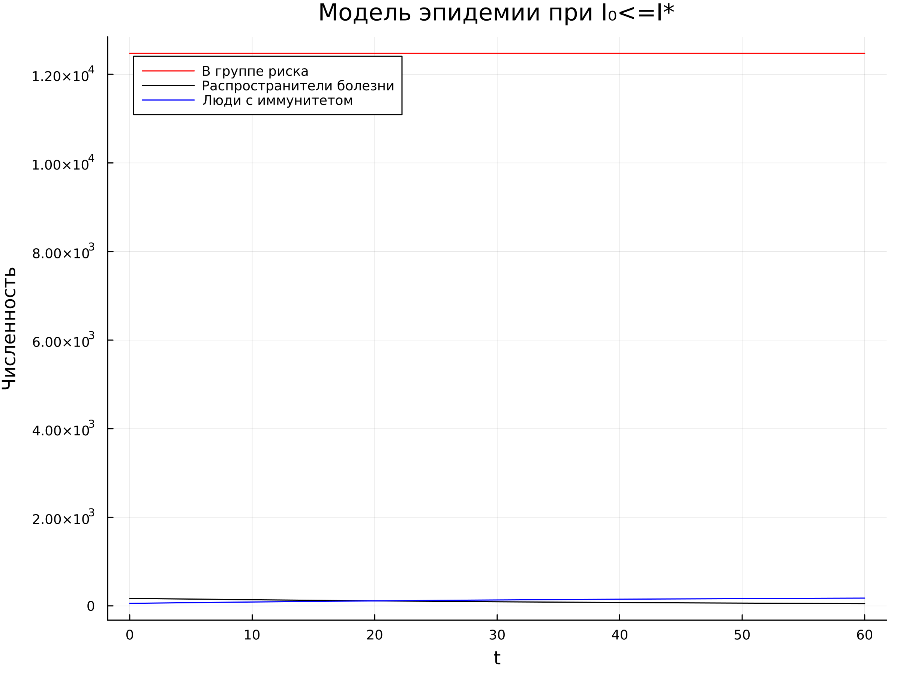
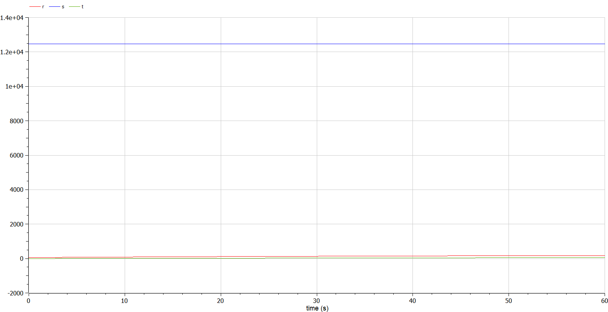
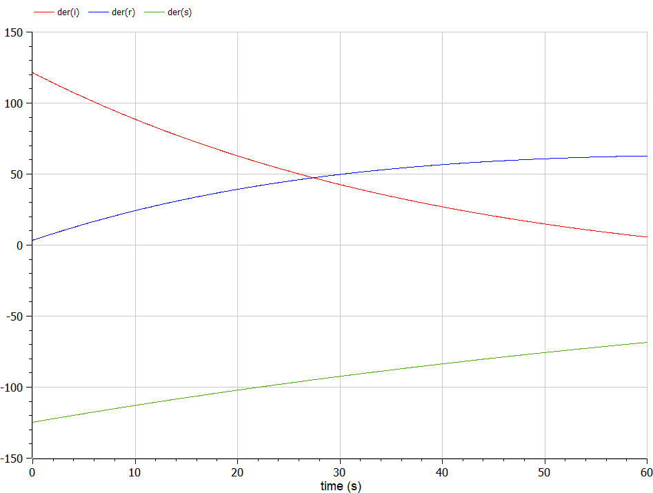

---
## Front matter
title: "Отчет по лабораторной работе №6"
subtitle: "Дисциплина: Математическое моделирование"
author: "Выполнил: Гаглоев Олег Мелорович"

## Generic otions
lang: ru-RU
toc-title: "Содержание"

## Bibliography
bibliography: bib/cite.bib
csl: pandoc/csl/gost-r-7-0-5-2008-numeric.csl

## Pdf output format
toc: true # Table of contents
toc-depth: 2
lof: true # List of figures
lot: true # List of tables
fontsize: 12pt
linestretch: 1.5
papersize: a4
documentclass: scrreprt
## I18n polyglossia
polyglossia-lang:
  name: russian
  options:
	- spelling=modern
	- babelshorthands=true
polyglossia-otherlangs:
  name: english
## I18n babel
babel-lang: russian
babel-otherlangs: english
## Fonts
mainfont: PT Serif
romanfont: PT Serif
sansfont: PT Sans
monofont: PT Mono
mainfontoptions: Ligatures=TeX
romanfontoptions: Ligatures=TeX
sansfontoptions: Ligatures=TeX,Scale=MatchLowercase
monofontoptions: Scale=MatchLowercase,Scale=0.9
## Biblatex
biblatex: true
biblio-style: "gost-numeric"
biblatexoptions:
  - parentracker=true
  - backend=biber
  - hyperref=auto
  - language=auto
  - autolang=other*
  - citestyle=gost-numeric
## Pandoc-crossref LaTeX customization
figureTitle: "Рис."
tableTitle: "Таблица"
listingTitle: "Листинг"
lofTitle: "Список иллюстраций"
lotTitle: "Список таблиц"
lolTitle: "Листинги"
## Misc options
indent: true
header-includes:
  - \usepackage{indentfirst}
  - \usepackage{float} # keep figures where there are in the text
  - \floatplacement{figure}{H} # keep figures where there are in the text
---

# Цель работы

Смоделировать задачу об эпидемии по средством языков программирования Julia и OpenModelica.

# Задание

- Построить графики изменения числа особей в каждой из трех групп

- Рассмотреть протекание эпидемия в двух различных случаях

# Теоретическое введение

Перед нами простейшая модель эпидемии. 

Предположим, что некая популяция, состоящая из $N$ особей, (считаем, что популяция изолирована) подразделяется на три группы. **Первая группа** - это восприимчивые к болезни, но пока здоровые особи, обозначим их через $S(t)$. **Вторая группа** – это число инфицированных особей, которые также при этом являются распространителями инфекции, обозначим их $I(t)$. А **третья группа**, обозначающаяся через $R(t)$ – это здоровые особи с иммунитетом к болезни.

До того, как число заболевших не превышает критического значения $I*$, считаем, что все больные изолированы и не заражают здоровых. Когда $I(t) > I*$, тогда инфицирование способны заражать восприимчивых к болезни особей.

Таким образом, скорость изменения числа $S(t)$ меняется по следующему
закону [-@eq:01]:

$$
\frac{dS}{dt} = 
 \begin{cases}
   -\alpha S,\ если\ I(t) > I^* 
   \\
   0,\ если\ I(t) \le I^*
 \end{cases}
$$ {#eq:01}

Поскольку каждая восприимчивая к болезни особь, которая, в конце концов,
заболевает, сама становится инфекционной, то скорость изменения числа
инфекционных особей представляет разность за единицу времени между
заразившимися и теми, кто уже болеет и лечится, т.е.:

$$
\frac{dI}{dt} = 
 \begin{cases}
   \alpha S - \beta I,\ если\ I(t) > I^* 
   \\
   -\beta I,\ если\ I(t) \le I^*
 \end{cases}
$$ {#eq:02}

А скорость изменения выздоравливающих особей (при этом приобретающие
иммунитет к болезни)

$$
\frac{dR}{dt} = \beta I
$$ {#eq:03}

Постоянные пропорциональности $\alpha$, $\beta$, - это коэффициенты заболеваемости и выздоровления соответственно.

Для того, чтобы решения соответствующих уравнений определялось
однозначно, необходимо задать начальные условия .Считаем, что на начало
эпидемии в момент времени $t=0$ нет особей с иммунитетом к болезни $R(0)=0$, а
число инфицированных и восприимчивых к болезни особей
$I(0)$ и
$S(0)$
соответственно. Для анализа картины протекания эпидемии необходимо
рассмотреть два случая: $I(0) \le I^*$ и $I(0) > I^*$.

Группы обозначены как S, I, R - отсюда модель эпидемии называют SIR-моделью. Эта модель создана методом системной динамики. Есть также её вариант, реализованный с помощью агентного моделирования (там есть возможность запустить эксперименты варьирования параметров и Монте-Карло 1-го и 2-го порядка). 

Разумеется, это очень упрощенная модель. Чтобы отражать действительность, модель должна основываться на реальных свойствах конкретной болезни и учитывать изменения системы под управленческими воздействиями – например, количество контактов можно снижать карантинными мерами . 

Часто еще вспоминают SEIR модель, которую рассматривают как модификацию SIR.

SEIR модель учитывает инкубационный период (E – exposed, индивиды болеют, но не заразны и со временем полностью заболеют). В такой модели заражение восприимчивых происходит таким же способом как в модели SIR, но попадают такие особи не в группу I, а в группу E. А из E с определённой вероятностью ($\alpha$, число обратное длительности инкубационного периода) происходит переход уже в I.

# Выполнение лабораторной работы

1. Вариант 38

2. Задача предложенного варианта состоит в следующем:

На одном острове вспыхнула эпидемия. Известно, что из всех проживающих
на острове ($N=12 700$) в момент начала эпидемии ($t=0$) число заболевших людей
(являющихся распространителями инфекции) $I(0)=170$, а число здоровых людей с иммунитетом к болезни $R(0)=57$. Таким образом, число людей восприимчивых к болезни, но пока здоровых, в начальный момент времени $S(0)=N-I(0)- R(0)$.

Постройте графики изменения числа особей в каждой из трех групп.
Рассмотрите, как будет протекать эпидемия в случае:

- если $I(t) \le I^*$

- если $I(t) > I^*$

3. Коэффициенты возьму из примера: $\alpha = 0.01$, $\beta = 0.02$. 

## Первый случай $I(t) \le I^*$

1. На языке Julia напишем код моделирующий изменение числа особей в каждой из трех групп - заболевших, здоровых с иммунитетом и здоровых, но восприимчивых:

```
using Plots
using DifferentialEquations
N=12700
I₀=170
R₀=57
S₀=N-I₀-R₀
T=(0.0,60)
u₀=[S₀,I₀,R₀]
a=0.01
b=0.02
function F!(du,u,p,t)
    du[1]=0
    du[2]=-b*u[2]
    du[3]=b*u[2]
end
prob=ODEProblem(F!,u₀,T)
sol=solve(prob,saveat=0.05)
const S=Float64[]
const I=Float64[]
const R=Float64[]
for u in sol.u
    s,i,r=u
    push!(S,s)
    push!(I,i)
    push!(R,r)
end
plt=plot(
dpi=300,
size=(800,600),
title="Модель эпидемии при I₀<=I*"
)
plot!(
plt,
sol.t,
S,
color=:red,
xlabel="t",
ylabel="Численность",
label="В группе риска"
)
plot!(
plt,
sol.t,
I,
color=:black,
xlabel="t",
ylabel="Численность",
label="Распространители болезни"

)
plot!(
plt,
sol.t,
R,
color=:blue,
xlabel="t",
ylabel="Численность",
label="Люди с иммунитетом"

)
savefig(plt,"Julia_1.png")

```

В качестве результата у нас график изменения численности заболеваемости (рис. [@fig:01]):

{#fig:01 width=70%}

1. Напишем код на OpenModelica:

```
model Lab06_1
constant Integer N= 12700;
constant Integer I0=170;
constant Integer R0= 57;
constant Integer S0=N-I0-R0; 
constant Real a=0.01;
constant Real b=0.02;
Real s(start=S0);
Real i(start=I0);
Real r(start=R0);
Real t=time;
equation
  der(s)=0;
  der(i)=-b*i;
  der(r)=b*i;
  annotation(experiment(StartTime = 0,StopTime = 100),Documentation);
end Lab06_1;

```

В качестве результата у нас график изменения численности численности заболеваемости (рис. [@fig:02]):

{#fig:02 width=70%}


## Второй случай $I(t) > I^*$

1. На языке Julia напишем код моделирующий изменение числа особей в каждой из трех групп - заболевших, здоровых с иммунитетом и здоровых, но восприимчивых:

```
using Plots
using DifferentialEquations
N=12700
I₀=170
R₀=57
S₀=N-I₀-R₀
T=(0.0,60)
u₀=[S₀,I₀,R₀]
a=0.01
b=0.02
function F!(du,u,p,t)
    du[1]=-a*u[1]
    du[2]=a*u[1]-b*u[2]
    du[3]=b*u[2]
end
prob=ODEProblem(F!,u₀,T)
sol=solve(prob,saveat=0.05)
const S=Float64[]
const I=Float64[]
const R=Float64[]
for u in sol.u
    s,i,r=u
    push!(S,s)
    push!(I,i)
    push!(R,r)
end
plt=plot(
dpi=300,
size=(800,600),
title="Модель эпидемии при I₀>I*"
)
plot!(
plt,
sol.t,
S,
color=:red,
xlabel="t",
ylabel="Численность",
label="В группе риска"
)
plot!(
plt,
sol.t,
I,
color=:black,
xlabel="t",
ylabel="Численность",
label="Распространители болезни"

)
plot!(
plt,
sol.t,
R,
color=:blue,
xlabel="t",
ylabel="Численность",
label="Люди с иммунитетом"

)
savefig(plt,"Julia_2.png")

```

В качестве результата у нас график изменения численности численности заболеваемости (рис. [@fig:03]):

{#fig:03 width=70%}

1. Напишем код на OpenModelica:

```
model Lab06_2
constant Integer N= 12700;
constant Integer I0=170;
constant Integer R0= 57;
constant Integer S0=N-I0-R0; 
constant Real a=0.01;
constant Real b=0.02;
Real s(start=S0);
Real i(start=I0);
Real r(start=R0);
Real t=time;
equation
  der(s)=-a*s;
  der(i)=a*s-b*i;
  der(r)=b*i;
  annotation(experiment(StartTime = 0,StopTime = 100));
end Lab06_2;

```

В качестве результата у нас график изменения численности численности заболеваемости (рис. [@fig:04]):

{#fig:04 width=70%}

# Выводы

- Мы смоделировали задачу об эпидемии по средством языков программирования Julia и OpenModelica

- Построили графики изменения числа особей в каждой из трех групп

- Рассмотрели протекание эпидемия в двух различных случаях

# Список литературы{.unnumbered}

::: [{#refs}](https://esystem.rudn.ru/pluginfile.php/1971738/mod_resource/content/2/Задание%20к%20лабораторной%20работе%20№%207%20%283%29.pdf)
:::