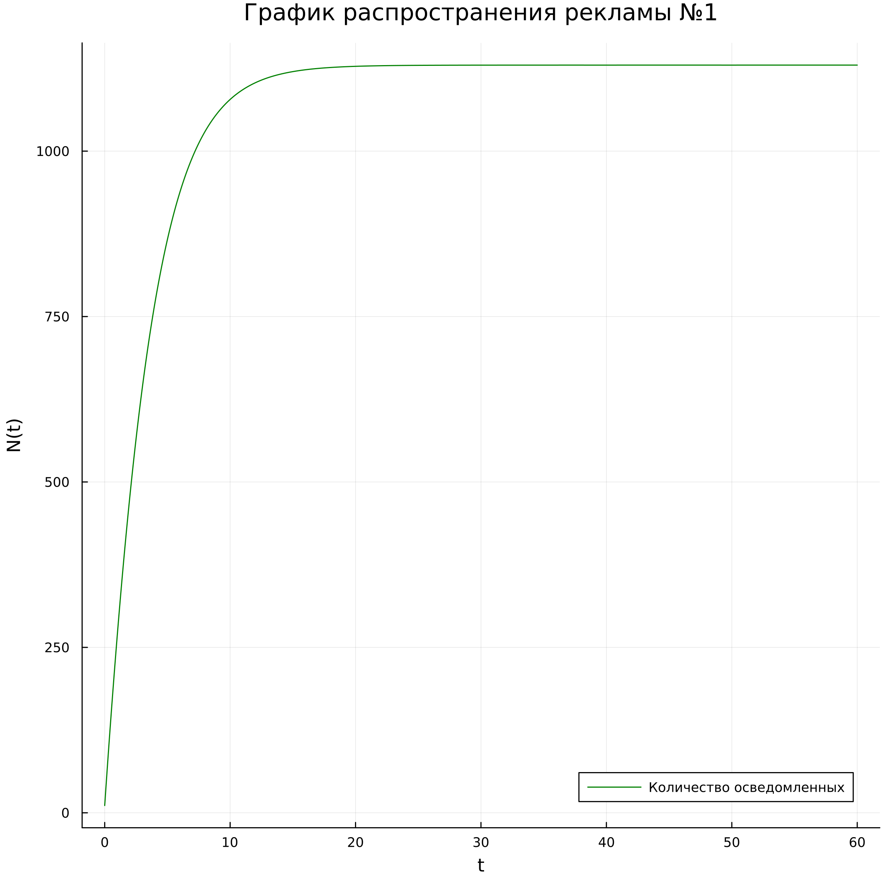
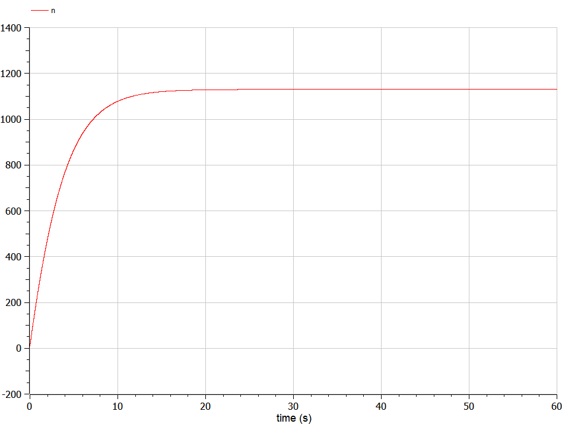
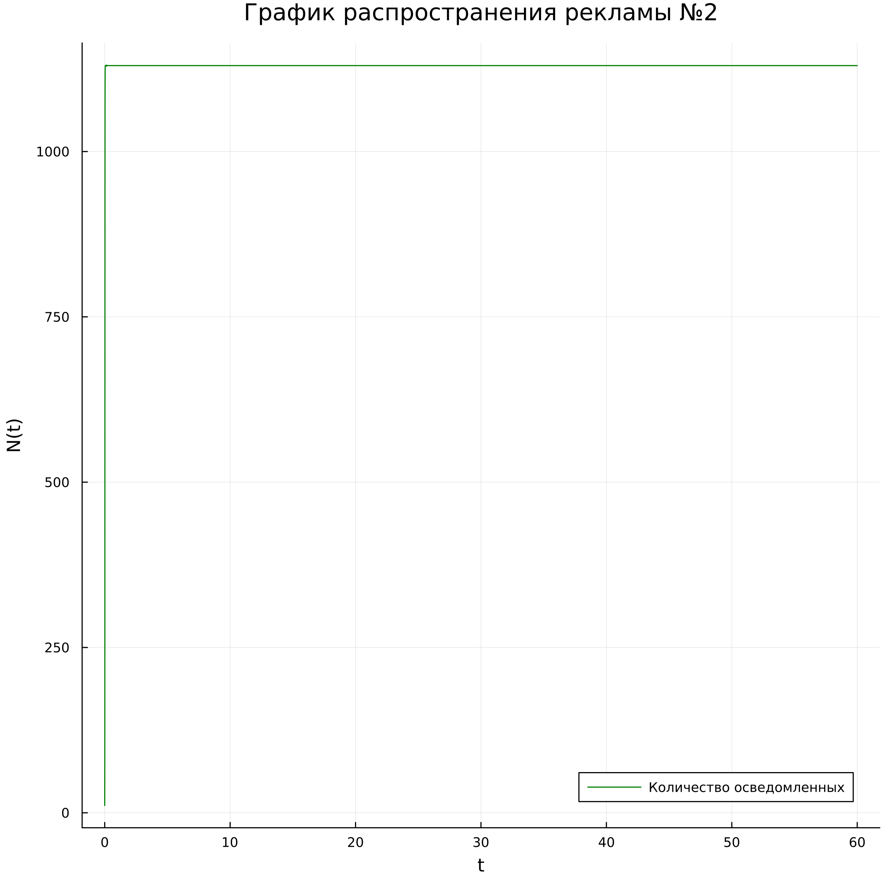
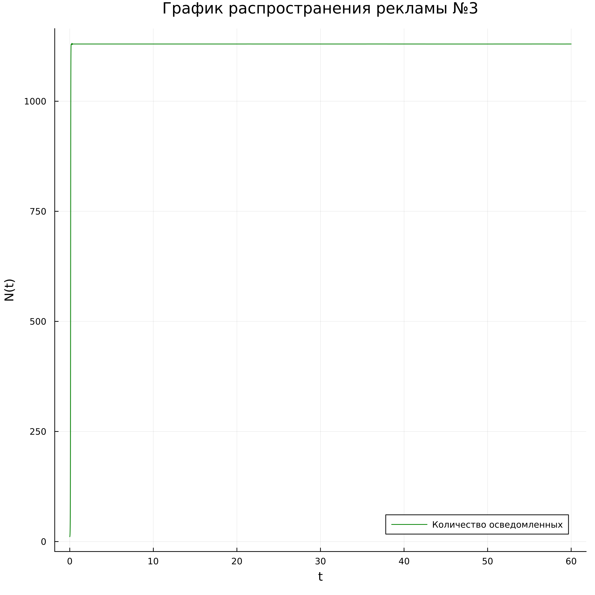

---
## Front matter
lang: ru-RU
title: Лабораторная работа №7
subtitle: Модель распространения рекламы
author:
  -  Гаглоев Олег Мелорович
institute:
  - Российский университет дружбы народов, Москва, Россия
date: 25 марта 2023

## i18n babel
babel-lang: russian
babel-otherlangs: english

## Formatting pdf
toc: false
toc-title: Содержание
slide_level: 2
aspectratio: 169
section-titles: true
theme: metropolis
header-includes:
 - \metroset{progressbar=frametitle,sectionpage=progressbar,numbering=fraction}
 - '\makeatletter'
 - '\beamer@ignorenonframefalse'
 - '\makeatother'
---

# Информация

## Докладчик

  * Гаглоев Олег Мелорович
  * студент уч. группы НПИбд-01-20
  * Российский университет дружбы народов
  * [1032201347@pfur.ru](mailto:1032201347@rudn.ru)
  * <https://github.com/SimpleOG>

# Вводная часть

## Актуальность

- Математика всегда полезна для ума

## Объект и предмет исследования

- Модель эффективности рекламы
- Языки для моделирования:
  - Julia
  - OpenModelica

## Цель лабораторной работы

Изучить модель эффективности рекламы

## Задание к лабораторной работе

1.	Изучить модель эффективности рекламы
2.	Построить графики распространения рекламы в заданных случайх
3.	Определить для случая 2 момент времени, в который скорость распространения рекламы будет максимальной

## Материалы и методы

- Языки для моделирования:
  - Julia
  - OpenModelica

# Процесс выполнения лабораторной работы

## Теория

$\frac{dn}{dt}$ - скорость изменения со временем числа потребителей, узнавших о товаре и готовых его купить,

$t$ - время, прошедшее с начала рекламной кампании,

$N$ - общее число потенциальных платежеспособных покупателей,

$n(t)$ - число  уже информированных клиентов.

Математическая модель распространения рекламы описывается уравнением:

$$\frac{dn}{dt} = (\alpha _1(t) + \alpha _2(t)n(t))(N-n(t))$$

## Условие задачи

Постройте график распространения рекламы, математическая модель которой описывается следующим уравнением:

1.	$\frac{dn}{dt} = (0.25 +0.000075n(t))(N-n(t))$
2.	$\frac{dn}{dt} = (0.000075+ 0.25n(t))(N-n(t))$
3.	$\frac{dn}{dt} = (0.25 \sin(t) + 0.75t*n(t))(N-n(t))$

При этом объем аудитории $N = 1130$, в начальный момент о товаре знает 11 человек.

Для случая 2 определите в какой момент времени скорость распространения рекламы будет иметь максимальное значение.

## Первый случай графики

:::::::::::::: {.columns align=center}
::: {.column width="40%"}

:::
::: {.column width="50%"}

:::
::::::::::::::

## Второй случай - графики

:::::::::::::: {.columns align=center}
::: {.column width="40%"}

:::
::: {.column width="50%"}

:::
::::::::::::::

## Третий случай - графики

:::::::::::::: {.columns align=center}
::: {.column width="40%"}

:::
::: {.column width="50%"}

:::
::::::::::::::
# Результаты работы

- Построил графики осведомленности пользователей

- Определил для случая 2 момент времени, в который скорость распространения рекламы будет максимальной

# Вывод

Смоделировал задачу о рекламе по средством языков программирования Julia и OpenModelica

[def]: https://github.com/SimpleOG/MatMod