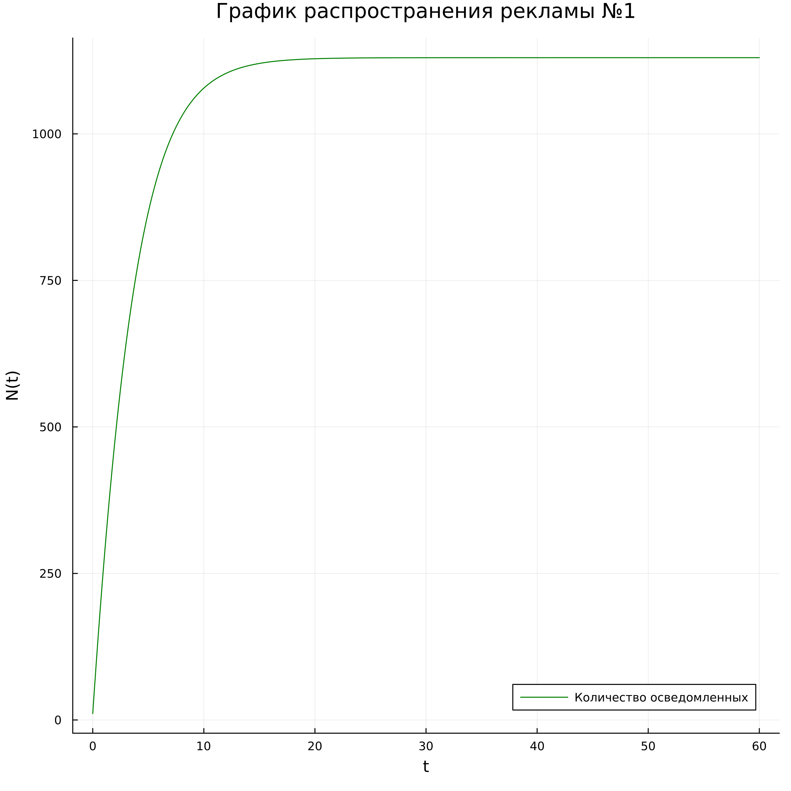
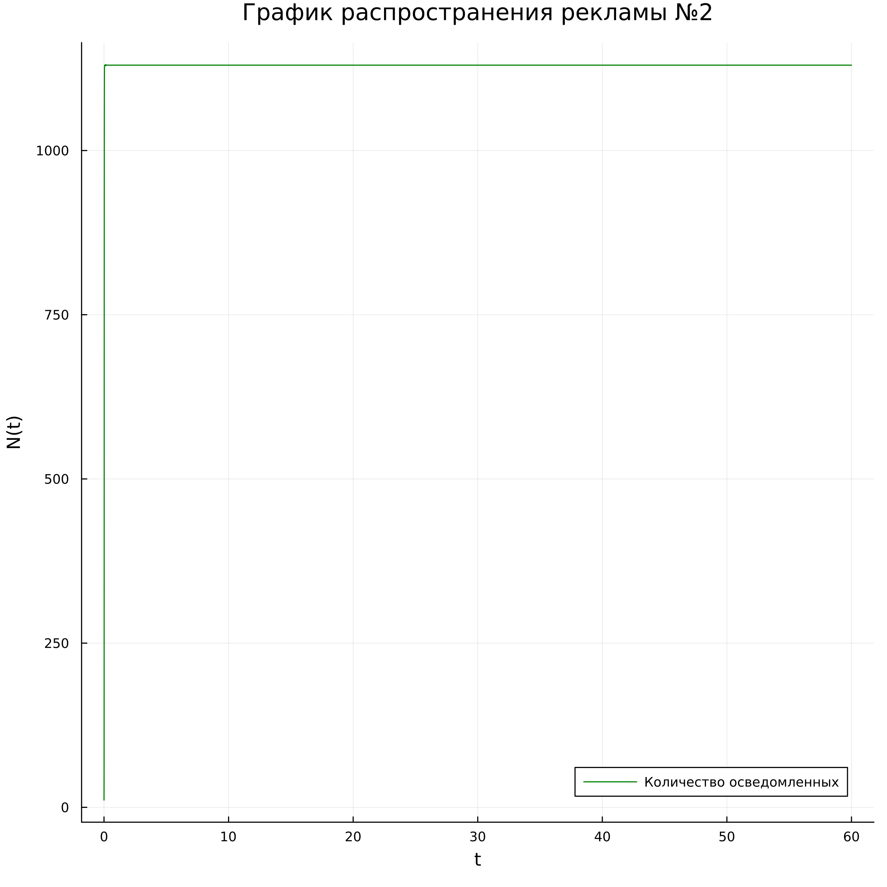

---
## Front matter
lang: ru-RU
title: "Отчет по лабораторной работе №7"
subtitle: "Модель распространения рекламы"
author: "Гаглоев Олег Мелорович" 
## Generic otions
lang: ru-RU
toc-title: "Содержание"

## Bibliography
bibliography: bib/cite.bib
csl: pandoc/csl/gost-r-7-0-5-2008-numeric.csl

## Pdf output format
toc: true # Table of contents
toc-depth: 2
lof: true # List of figures
lot: true # List of tables
fontsize: 12pt
linestretch: 1.5
papersize: a4
documentclass: scrreprt
## I18n polyglossia
polyglossia-lang:
  name: russian
  options:
	- spelling=modern
	- babelshorthands=true
polyglossia-otherlangs:
  name: english
## I18n babel
babel-lang: russian
babel-otherlangs: english
## Fonts
mainfont: PT Serif
romanfont: PT Serif
sansfont: PT Sans
monofont: PT Mono
mainfontoptions: Ligatures=TeX
romanfontoptions: Ligatures=TeX
sansfontoptions: Ligatures=TeX,Scale=MatchLowercase
monofontoptions: Scale=MatchLowercase,Scale=0.9
## Biblatex
biblatex: true
biblio-style: "gost-numeric"
biblatexoptions:
  - parentracker=true
  - backend=biber
  - hyperref=auto
  - language=auto
  - autolang=other*
  - citestyle=gost-numeric
## Pandoc-crossref LaTeX customization
figureTitle: "Рис."
tableTitle: "Таблица"
listingTitle: "Листинг"
lofTitle: "Список иллюстраций"
lotTitle: "Список таблиц"
lolTitle: "Листинги"
## Misc options
indent: true
header-includes:
  - \usepackage{indentfirst}
  - \usepackage{float} # keep figures where there are in the text
  - \floatplacement{figure}{H} # keep figures where there are in the text
---

# Цель работы

Изучить модель эффективности рекламы

# Задание

1.	Изучить модель эфеективности рекламы
2.	Построить графики распространения рекламы в заданных случайх
3.	Определить для случая 2 момент времени, в который скорость распространения рекламы будет максимальной
# Теоретическое введение

Организуется рекламная кампания нового товара или услуги. Необходимо, чтобы прибыль будущих продаж с избытком покрывала издержки на рекламу. Вначале расходы могут превышать прибыль, поскольку лишь малая часть потенциальных покупателей будет информирована о новинке. Затем, при увеличении числа продаж, возрастает и прибыль, и, наконец, наступит момент, когда рынок насытиться, и рекламировать товар станет бесполезным.

Предположим, что торговыми учреждениями реализуется некоторая продукция, о которой в момент времени $t$ из числа потенциальных покупателей $N$ знает лишь $n$ покупателей. Для ускорения сбыта продукции запускается реклама по радио, телевидению и других средств массовой информации. После запуска рекламной кампании информация о продукции начнет распространяться среди потенциальных покупателей путем общения друг с другом. Таким образом, после запуска рекламных объявлений скорость изменения числа знающих о продукции людей пропорциональна как числу знающих о товаре покупателей, так и числу покупателей о нем не знающих

Модель рекламной кампании описывается следующими величинами.
Считаем, что $\frac{dn}{dt}$ - скорость изменения со временем числа потребителей, узнавших о товаре и готовых его купить,
$t$ - время, прошедшее с начала рекламной кампании,
$N$ - общее число потенциальных платежеспособных покупателей,
$n(t)$ - число  уже информированных клиентов.
Эта величина пропорциональна числу покупателей, еще не знающих о нем, это описывается следующим образом
$\alpha _1(t)(N-n(t))$, где $\alpha _1>0$ -  характеризует интенсивность рекламной кампании (зависит от затрат на рекламу в данный момент времени).
Помимо этого, узнавшие о товаре потребители также распространяют полученную информацию среди потенциальных покупателей, не знающих о нем (в этом случае работает т.н. сарафанное радио). Этот вклад в рекламу описывается величиной  $\alpha _2(t)n(t)(N-n(t))$. эта величина увеличивается с увеличением потребителей узнавших о товаре.

Математическая модель распространения рекламы описывается уравнением:

$$\frac{dn}{dt} = (\alpha _1(t) + \alpha _2(t)n(t))(N-n(t))$$


# Выполнение лабораторной работы

1. Вариант 38

2. Постройте график распространения рекламы, математическая модель которой описывается следующим уравнением:

1.	$\frac{dn}{dt} = (0.25 +0.000075n(t))(N-n(t))$
2.	$\frac{dn}{dt} = (0.000075+ 0.25n(t))(N-n(t))$
3.	$\frac{dn}{dt} = (0.25 \sin(t) + 0.75t*n(t))(N-n(t))$

При этом объем аудитории $N = 1130$, в начальный момент о товаре знает 11 человек.

Для случая 2 определите в какой момент времени скорость распространения рекламы будет иметь максимальное значение.

## Первый случай 

1. На языке Julia напишем код моделирующий изменение числа особей в каждой из трех групп - заболевших, здоровых с иммунитетом и здоровых, но восприимчивых:

```
using Plots
using DifferentialEquations
N=1130
n=11
u₀=[n]
T=(0.0,60.0)
a=0.25
b=0.000075 
function F!(du,u,p,t)
    du[1]=(a+b*u[1])*(N-u[1])
end
prob=ODEProblem(F!,u₀,T)
sol=solve(prob,saveat=0.001)
const M = Float64[]
for u in sol.u
    n=u[1]
    push!(M,n)
end    
plt=plot(
    dpi=300,
    size=(800,800),
    title="График распространения рекламы №1"

)
plot!(
    plt,
    sol.t,
    M,
    color=:green,
    xlabel="t",
    ylabel="N(t)",
    label="Количество осведомленных"

)
savefig(plt,"Julia_1.png")

```

В качестве результата у нас график изменения численности осведомлённых (рис. [@fig:01]):

{#fig:01 width=70%}

2. Напишем код на OpenModelica:

```
  model Lab07_1
constant Integer N=1130;
constant Integer n0=11;
constant Real a=0.25;
constant Real b=0.000075;
Real n(start=n0);
Real t= time;
equation
der(n)=(a+b*n)*(N-n);
annotation(experiment(StartTime = 0,StopTime = 60));

  end Lab07_1;

```

В качестве результата у нас график изменения численности осведомлённых (рис. [@fig:02]):

{#fig:02 width=70%}


## Второй случай 

1. Код на julia

```
using Plots
using DifferentialEquations
N=1130
n=11
u₀=[n]
T=(0.0,60.0)
b=0.25
a=0.000075 
function F!(du,u,p,t)
    du[1]=(a+b*u[1])*(N-u[1])
end
prob=ODEProblem(F!,u₀,T)
sol=solve(prob,saveat=0.001)
const M = Float64[]
for u in sol.u
    n=u[1]
    push!(M,n)
end    
plt=plot(
    dpi=300,
    size=(800,800),
    title="График распространения рекламы №2"

)
plot!(
    plt,
    sol.t,
    M,
    color=:green,
    xlabel="t",
    ylabel="N(t)",
    label="Количество осведомленных"

)
savefig(plt,"Julia_2.png")

```

В качестве результата у нас график изменения численности осведомлённых (рис. [@fig:03]):

{#fig:03 width=70%}

2. Напишем код на OpenModelica:

```
model Lab07_2
constant Integer N=1130;
constant Integer n0=11;
constant Real b=0.25;
constant Real a=0.000075;
Real n(start=n0);
Real t= time;
equation
der(n)=(a+b*n)*(N-n);
annotation(experiment(StartTime = 0,StopTime = 60));
end Lab07_2;

```

В качестве результата у нас график изменения численности осведомлённых (рис. [@fig:04]):

{#fig:04 width=70%}

Максимальная скорость распространения при этом  достигается при $t=0$

## Третий случай 

1. Напишем код на Julia:

```
using Plots
using DifferentialEquations
N=1130
n=11
u₀=[n]
T=(0.0,60.0)
function a(t)
    return 0.25*sin(t)
end
function b(t)
    return 0.75*t
end
function F!(du,u,p,t)
    du[1]=(a(t)+b(t)*u[1])*(N-u[1])
end
prob=ODEProblem(F!,u₀,T)
sol=solve(prob,saveat=0.001)
const M = Float64[]
for u in sol.u
    n=u[1]
    push!(M,n)
end    
plt=plot(
    dpi=300,
    size=(800,800),
    title="График распространения рекламы №3"

)
plot!(
    plt,
    sol.t,
    M,
    color=:green,
    xlabel="t",
    ylabel="N(t)",
    label="Количество осведомленных"

)
savefig(plt,"Julia_3.png")
```
В качестве результата у нас график изменения численности осведомлённых (рис. [@fig:05]):


1. Напишем код на OpenModelica:
```
model Lab07_3
constant Integer N=1130;
constant Integer n0=11;
constant Real a=0.25;
constant Real b=0.75;
Real n(start=n0);
Real t= time;
equation
der(n)=(a*sin(t)+b*t*n)*(N-n);
annotation(experiment(StartTime = 0,StopTime = 60));
end Lab07_3;
```
В качестве результата у нас график изменения численности осведомлённых (рис. [@fig:06]):


# Выводы

В ходе выполнения лабораторной работы была изучена модель эффективности рекламы и построены графики.


# Список литературы {.unnumbered}

1.https://esystem.rudn.ru/pluginfile.php/1971742/mod_resource/content/2/Задание%20к%20лабораторной%20работе%20№%202%20%20%281%29.pdf