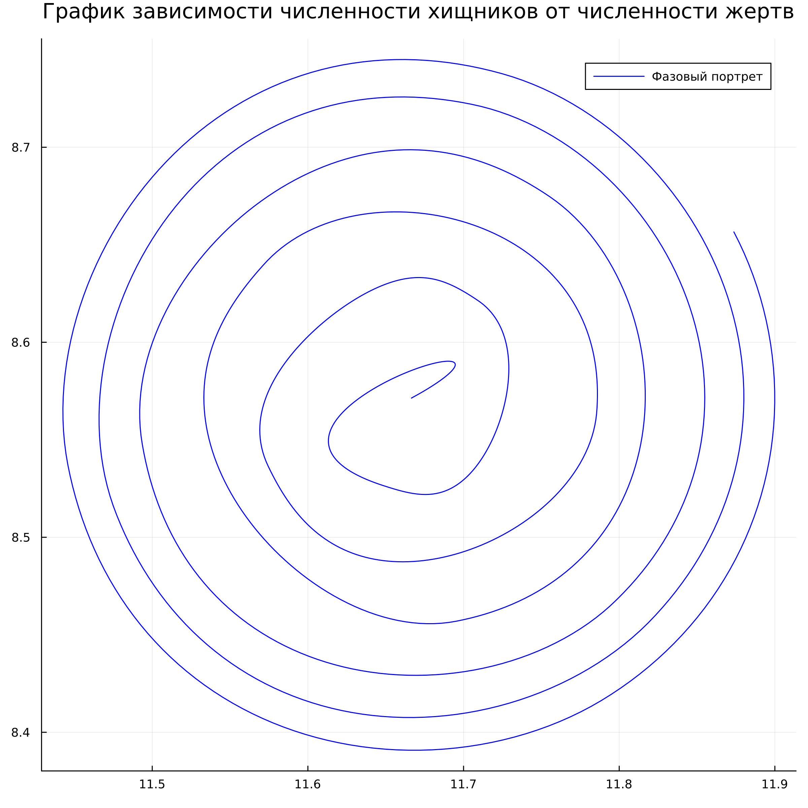
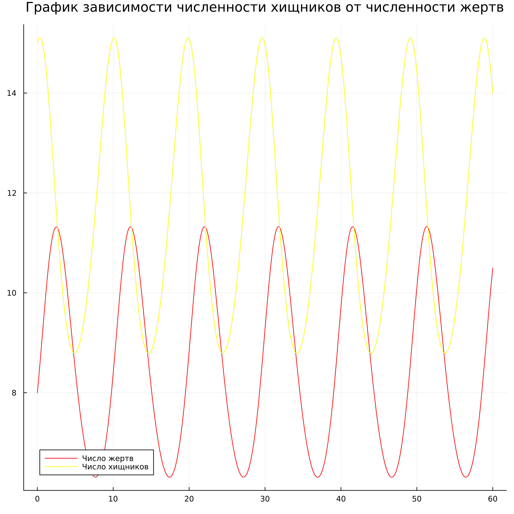
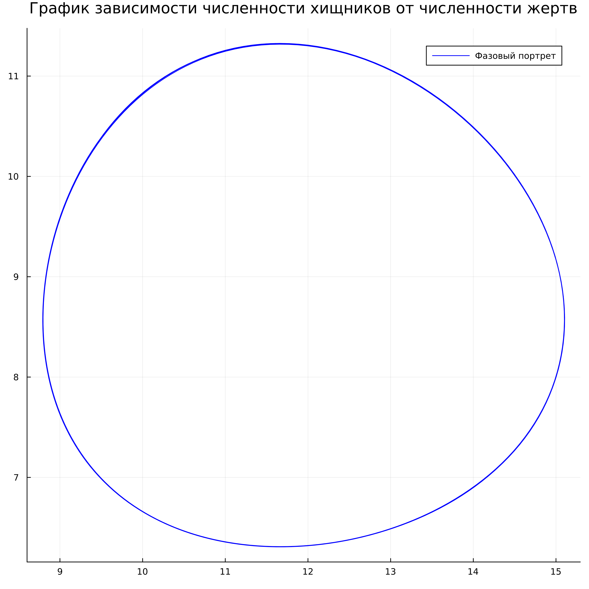
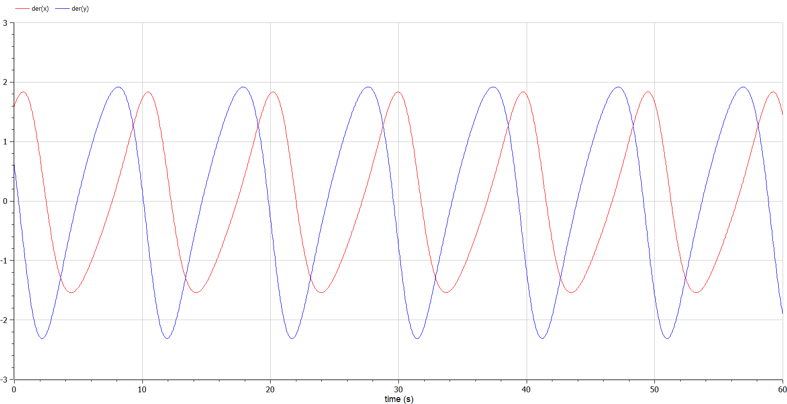
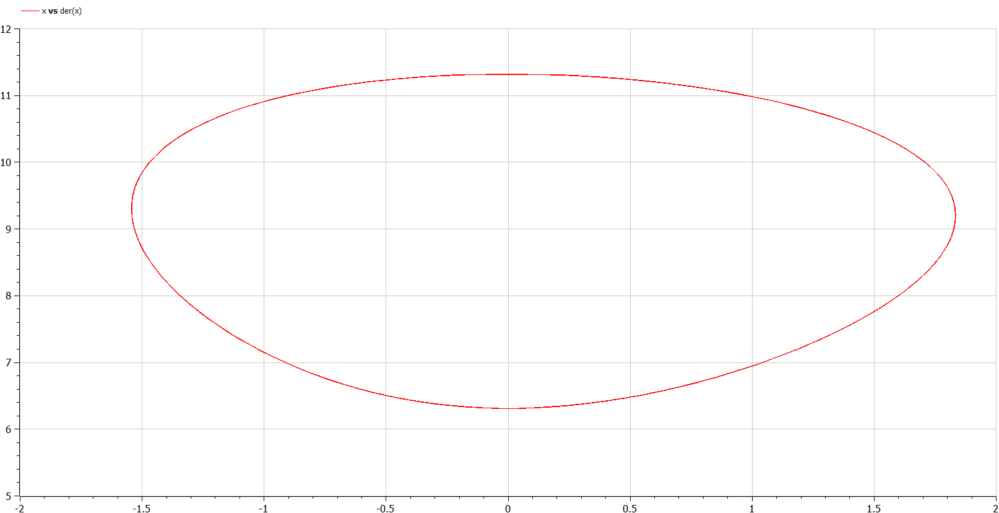
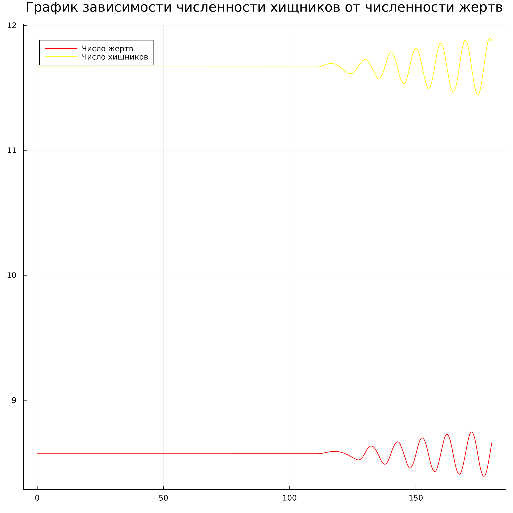

---
## Front matter
title: "Отчет по лабораторной работе №5"
subtitle: "Дисциплина: Математическое моделирование"
author: "Выполнил: Гаглоев Олег Мелорович"

## Generic otions
lang: ru-RU
toc-title: "Содержание"

## Bibliography
bibliography: bib/cite.bib
csl: pandoc/csl/gost-r-7-0-5-2008-numeric.csl

## Pdf output format
toc: true # Table of contents
toc-depth: 2
lof: true # List of figures
lot: true # List of tables
fontsize: 12pt
linestretch: 1.5
papersize: a4
documentclass: scrreprt
## I18n polyglossia
polyglossia-lang:
  name: russian
  options:
	- spelling=modern
	- babelshorthands=true
polyglossia-otherlangs:
  name: english
## I18n babel
babel-lang: russian
babel-otherlangs: english
## Fonts
mainfont: PT Serif
romanfont: PT Serif
sansfont: PT Sans
monofont: PT Mono
mainfontoptions: Ligatures=TeX
romanfontoptions: Ligatures=TeX
sansfontoptions: Ligatures=TeX,Scale=MatchLowercase
monofontoptions: Scale=MatchLowercase,Scale=0.9
## Biblatex
biblatex: true
biblio-style: "gost-numeric"
biblatexoptions:
  - parentracker=true
  - backend=biber
  - hyperref=auto
  - language=auto
  - autolang=other*
  - citestyle=gost-numeric
## Pandoc-crossref LaTeX customization
figureTitle: "Рис."
tableTitle: "Таблица"
listingTitle: "Листинг"
lofTitle: "Список иллюстраций"
lotTitle: "Список таблиц"
lolTitle: "Листинги"
## Misc options
indent: true
header-includes:
  - \usepackage{indentfirst}
  - \usepackage{float} # keep figures where there are in the text
  - \floatplacement{figure}{H} # keep figures where there are in the text
---

# Цель работы

Создать простейшую модель взаимодействия двух видов типа «хищник — жертва» - модель Лотки-Вольтерры.

# Задание

- Построить график зависимости численности хищников от численности жертв
- Построить графики изменения численности хищников и численности жертв при заданных начальных условиях
- Найти стационарное состояние системы 

# Теоретическое введение

Простейшая модель взаимодействия двух видов типа «хищник — жертва» -
**Модель Лотки-Вольтерры**. Данная двувидовая модель основывается на
следующих предположениях:

- Численность популяции жертв x и хищников y зависят только от времени
(модель не учитывает пространственное распределение популяции на
занимаемой территории)
- В отсутствии взаимодействия численность видов изменяется по модели
Мальтуса, при этом число жертв увеличивается, а число хищников падает
- Естественная смертность жертвы и естественная рождаемость хищника
считаются несущественными
- Эффект насыщения численности обеих популяций не учитывается
- Скорость роста численности жертв уменьшается пропорционально
численности хищников (формула [-@eq:01])

$$
\begin{cases}
	\frac{dx}{dt} = ax(t) - bx(t)y(t)
	\\
	\frac{dy}{dt} = -cy(t) + dx(t)y(t)
\end{cases}
$$ {#eq:01}

В этой модели $x$ – число жертв, $y$ - число хищников. Коэффициент $a$
описывает скорость естественного прироста числа жертв в отсутствие хищников, $с$ - естественное вымирание хищников, лишенных пищи в виде жертв. Вероятность взаимодействия жертвы и хищника считается пропорциональной как количеству жертв, так и числу самих хищников $(xy)$. Каждый акт взаимодействия уменьшает популяцию жертв, но способствует увеличению популяции хищников (члены $-bxy$ и $dxy$ в правой части уравнения). 

{#fig:01 width=70%}

Математический анализ этой (жесткой) модели показывает, что имеется
стационарное состояние, всякое же другое начальное состояние ($B$) приводит к периодическому колебанию численности как жертв, так и хищников,
так что по прошествии некоторого времени система возвращается в состояние $B$.
Стационарное состояние системы  (положение равновесия, не зависящее от времени решение) будет в точке: $x_0=\frac{c}{d}$, $y_0=\frac{a}{b}$. Если начальные значения
задать в стационарном состоянии $x(0)=x_0$, $y(0)=y_0$, то в любой момент времени численность популяций изменяться не будет. При малом отклонении от положения равновесия численности как хищника, так и жертвы с течением времени не возвращаются к равновесным значениям, а совершают периодические колебания вокруг стационарной точки. Амплитуда колебаний и их период определяется начальными значениями численностей $x(0)$, $y(0)$. Колебания совершаются в
противофазе.

При малом изменении модели

$$
\begin{cases}
	\frac{dx}{dt} = ax(t) - bx(t)y(t) + \varepsilon f(x,y)
	\\
	\frac{dy}{dt} = -cy(t) + dx(t)y(t) + \varepsilon g(x,y) , \varepsilon \ll 1
\end{cases}
$$

(прибавление к правым частям малые члены, учитывающие, например,
конкуренцию жертв за пищу и хищников за жертв), вывод о периодичности
(возвращении системы в исходное состояние $B$), справедливый для жесткой
системы Лотки-Вольтерры, теряет силу. Таким образом, мы получаем так
называемую мягкую модель «хищник-жертва». В зависимости от вида малых
поправок $f$ и $g$ возможны следующие сценарии 1-3.


**Первый случай** равновесное состояние A устойчиво. При любых других
начальных условиях через большое время устанавливается именно оно.

**Второй случай** система стационарное состояние неустойчиво. Эволюция
приводит то к резкому увеличению числа хищников, то к их почти полному
вымиранию. Такая система в конце концов попадает в область столь больших или
столь малых значений x и y, что модель перестает быть применимой.

**Третий случай** в системе с неустойчивым стационарным состоянием A с
течением времени устанавливается периодический режим. В отличие от исходной
жесткой модели Лотки-Вольтерры, в этой модели установившийся периодический
режим не зависит от начального условия. Первоначально незначительное
отклонение от стационарного состояния A приводит не к малым колебаниям около
A, как в модели Лотки-Вольтерры, а к колебаниям вполне определенной (и не
зависящей от малости отклонения) амплитуды. Возможны и другие структурно
устойчивые сценарии (например, с несколькими периодическими режимами).

Вывод: *жесткую модель всегда надлежит исследовать на структурную
устойчивость полученных при ее изучении результатов по отношению к малым изменениям модели (делающим ее мягкой).*

В случае модели Лотки-Вольтерры для суждения о том, какой же из
сценариев 1-3 (или иных возможных) реализуется в данной системе, совершенно
необходима дополнительная информация о системе (о виде малых поправок f и g в
нашей формуле). Математическая теория мягких моделей указывает, какую именно
информацию для этого нужно иметь. Без этой информации жесткая модель может
привести к качественно ошибочным предсказаниям. Доверять выводам, сделанным
на основании жесткой модели, можно лишь тогда, когда они подтверждаются
исследованием их структурной устойчивости.

Фазовые кривые формируются (фазовый поток) вокруг положения равновесия (стационарное состояние) (рис. [@fig:01]):

{#fig:01 width=70%}

# Выполнение лабораторной работы

1. Вариант 1032201347 % 70 + 1 = 38

2. Задача предложенного варианта состоит в следующем:

Для модели «хищник-жертва»:

$$
\begin{cases}
	\frac{dx}{dt} = -0.7x(t) + 0.06x(t)y(t)
	\\
	\frac{dy}{dt} = 0.6y(t) - 0.07x(t)y(t)
\end{cases}
$$ {#eq:03}

Постройте график зависимости численности хищников от численности жертв (фазовый портрет),
а также графики изменения численности хищников и численности жертв при
следующих начальных условиях: $x_0=8$, $y_0=15$. Найдите стационарное
состояние системы.

1. По коэффициентам видим, что в данном случае y - число жертв, x - число хищников. Тогда, из условия коэффициенты имеют следующие значения: $a = 0.7$, $b = 0.06$, $c = 0.6$, $d = 0.07$.

А уравнение имеет следующий вид:

$$
\begin{cases}
	\frac{dx}{dt} = ax(t) + bx(t)y(t)
	\\
	\frac{dy}{dt} = -сy(t) - dx(t)y(t)
\end{cases}
$$ {#eq:04}

4. На языке Julia напишем код моделирующий взаимосвязь между хищниками и жертвами:

```
using DifferentialEquations
using Plots

x₀=8
y₀=15

a=0.7
b=0.06
c=0.6
d=0.07

u₀=[x₀,y₀]
T=(0.0,60.0)
function F!(du,u,p,t)
    du[1]=-a*u[1]+b*u[1]*u[2]
    du[2]=c*u[2]-d*u[1]*u[2]   
end
prob=ODEProblem(F!,u₀,T)
sol=solve(prob,saveat=0.05)

const X =Float64[]
const Y =Float64[]

for u in sol.u
    x,y=u
    push!(X,x)
    push!(Y,y)
end

plt=plot(
    dpi=300,
    size=(800,800),
    title="График зависимости численности хищников от численности жертв"
)

plot!(
    plt,
    Y,
    X,
    color=:blue,
    label="Фазовый портрет"
)
savefig(plt,"Lab05_Julia.png")

plt2=plot(
    dpi=300,
    size=(800,800),
    title="График зависимости численности хищников от численности жертв"
)  
plot!(

plt2,
sol.t,
X,
color=:red,
label="Число жертв"
)
plot!(

plt2,
sol.t,
Y,
color=:yellow,
label="Число хищников"
)
savefig(plt2,"Lab05_Julia_1.png")
```

В качестве результата у нас графики изменения численности хищников и жертв (рис. [@fig:03]-[@fig:04]):

{#fig:03 width=70%}

{#fig:04 width=70%}

1. Напишем код на OpenModelica:

```
model Lab05
constant Integer x0=8;
constant Integer y0=15;
constant Real a =0.7;
constant Real b = 0.06;
constant Real c = 0.6;
constant Real d = 0.07;
Real x(start=x0);
Real y(start=y0);
Real t=time;
equation
der(x)=-a*x+b*x*y;
der(y)=c*y-d*x*y;
annotation(experiment(StartTime = 0,StopTime = 60));
end Lab05;

```

В качестве результата у нас графики изменения численности хищников и жертв (рис. [@fig:05]-[@fig:06]):

{#fig:05 width=70%}

{#fig:06 width=70%}

1. Теперь найдем стационарное состояние по формуле: $x_0=\frac{a}{b}$, $y_0=\frac{c}{d}$

Код для нахождения состояния и проверки правильности его обнаружения напишем на Julia. В нем выведем полученные значения и посчитаем его начальным значением численности хищников и жертв.

```
using DifferentialEquations
using Plots


a=0.7
b=0.06
c=0.6
d=0.07

x₀=c/d
y₀=a/b
u₀=[x₀,y₀]
T=(0.0,60.0)
function F!(du,u,p,t)
    du[1]=-a*u[1]+b*u[1]*u[2]
    du[2]=c*u[2]-d*u[1]*u[2]   
end
prob=ODEProblem(F!,u₀,T)
sol=solve(prob,saveat=0.05)
const X =Float64[]
const Y =Float64[]
@show x₀
@show y₀
for u in sol.u
    x,y=u
    push!(X,x)
    push!(Y,y)
end

plt=plot(
    dpi=300,
    size=(800,800),
    title="График зависимости численности хищников от численности жертв"
)

plot!(
    plt,
    Y,
    X,
    color=:blue,
    label="Фазовый портрет"
)
savefig(plt,"Lab05_Julia_Phase2.png")

plt2=plot(
    dpi=300,
    size=(800,800),
    title="График зависимости численности хищников от численности жертв"
)  
plot!(

plt2,
sol.t,
X,
color=:red,
label="Число жертв"
)
plot!(

plt2,
sol.t,
Y,
color=:yellow,
label="Число хищников"
)
savefig(plt2,"Lab05_Julia_1_2.png")
```

Значения стационарного состояния следующие (рис. [@fig:07]):

{#fig:07 width=70%}

Результаты получены следующие (рис. [@fig:08]):

{#fig:08 width=70%}


# Выводы

Мы создали простейшую модель взаимодействия двух видов типа «хищник — жертва» - модель Лотки-Вольтерры. Нашли стационарное состояние.

# Список литературы{.unnumbered}

Модель хищник-жертва [Электронный ресурс]. URL: https://esystem.rudn.r
u/pluginfile.php/1971733/mod_resource/content/2/%D0%9B%D0%B0%D0%B1
%D0%BE%D1%80%D0%B0%D1%82%D0%BE%D1%80%D0%BD%D0%B0%D1%
8F%20%D1%80%D0%B0%D0%B1%D0%BE%D1%82%D0%B0%20%E2%84%9
6%204.pdf.
